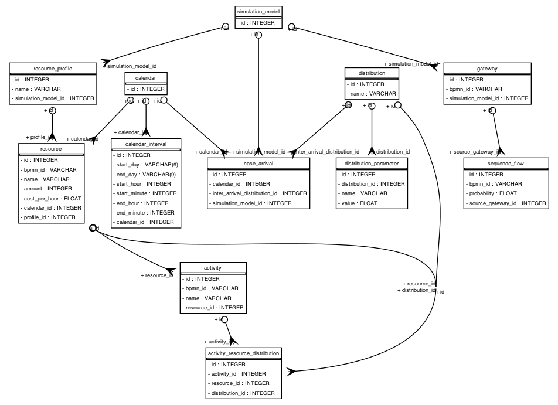

# Simulation Copilot

A prototype to explore a possibility to handle simulation scenario generation using conversational UI.

## Approaches

- Agent-based using tools
  - Basic using Python functions for composing BPS models
  - Using storage to make incremental changes (SQL)
- Multi-agent when a single agent cannot handle the complexity

## Milestones. Sprint 1

- [x] Generate a single component of the scenario with Python code (calendars)
- [x] Generate a single component of the scenario with LLM (calendars)
- [x] Generate the resource model with Python code
- [x] Generate the resource model with LLM
- [x] Generate a simple scenario with Python code
- [x] Generate a simple scenario with LLM using the Python code as a "tool"
- [x] Provide a simple scenario and ask LLM to apply some changes
- [x] Try storing the simulation model in a SQL format
- [x] Change average activity duration by N minutes (models should change the mean value of the distribution of a certain activity)
- [ ] Increase complexity: add more components of the simulation scenario or more adjustments

## Milestones. Sprint 2

- [x] Provide templated SQL-based tools instead of using raw SQL.
- [x] Make Anthropic Claude3 work with tools without LangChain on simple queries.
- [X] More complex test:
  - (a) provide initial simulation model before asking LLM;
  - (b) then comes the user's request to change something in the model;
  - (c) dump the new model ready for Prosimos simulation.
- [x] Add either another agent or tool for running Prosimos simulation to compare the initial and updated simulation model.
- [ ] Add simple UI because sometimes LLM asks reasonable clarification questions.

## Getting started with the SQL approach

```shell
# set up the environment
pipenv install

# activate the environment
pipenv shell

# initialize the database
# and write the table schemas to a file for the agent instructions
python src/simulation_copilot/sql_approach/init_db.py

# run the agent
python src/simulation_copilot/sql_approach/main.py
```

## SQL approach: relational simulation data  model



## For developers

### Pre-commit checks

Install pre-commit hooks configured in `.pre-commit-config.yaml` by running:

```shell
pre-commit install
```

After hitting the "commit" button, pre-commit will run the hooks on the files you are trying to commit. It may take some seconds before the commit is actually executed or rejected with a report of the issues found.

### Automated tests

Run the tests with the following command:

```shell
TESTING="true" python -m unittest discover -v
```

## SQL approach with Antropic's Claude 3 OPUS: complex workflow with performance analysis

Same as with "complex workflow" below but including performance analysis by LLM given statistics generated by Prosimos

**NOTE**: LLM got waiting time wrong, 15K seconds (LLM) vs 1.5M seconds (real), but it got the trend right, waiting time has decreased.

<details><summary>See full log</summary>

```shell
USER:
  What if we increase the amount of resource named 'Carmen Finacse' to 3 and 'Esmeralda Clay' to 3?

ASSISTANT [stop_reason=tool_use]:
  <thinking>
  To change the amount of resources, I need to use the change_resource_amount tool. This requires the resource ID and the new amount.

  The user provided the resource names 'Carmen Finacse' and 'Esmeralda Clay', but not their IDs. I can use the get_resource_id_by_name tool to look up the IDs based on the names.

  For 'Carmen Finacse':
  [wants to run 'get_resource_id_by_name' with input {'name': 'Carmen Finacse'}]
* [running name='get_resource_id_by_name' description='get_resource_id_by_name(name: str) -> int - Returns the ID of the resource with the given name.' args_schema=<class 'pydantic.v1.main.get_resource_id_by_nameSchema'> func=<function get_resource_id_by_name at 0x16bf7b700> on ToolUseBlock(id='toolu_01HjT7ayf1Qpdi2re9mHmJbX', input={'name': 'Carmen Finacse'}, name='get_resource_id_by_name', type='tool_use')]

USER:
  23

ASSISTANT [stop_reason=tool_use]:
  The ID for 'Carmen Finacse' is 23.

  For 'Esmeralda Clay':
  [wants to run 'get_resource_id_by_name' with input {'name': 'Esmeralda Clay'}]
* [running name='get_resource_id_by_name' description='get_resource_id_by_name(name: str) -> int - Returns the ID of the resource with the given name.' args_schema=<class 'pydantic.v1.main.get_resource_id_by_nameSchema'> func=<function get_resource_id_by_name at 0x16bf7b700> on ToolUseBlock(id='toolu_01Qk4qqveeszL5EtsTNjRHuW', input={'name': 'Esmeralda Clay'}, name='get_resource_id_by_name', type='tool_use')]

USER:
  22

ASSISTANT [stop_reason=tool_use]:
  The ID for 'Esmeralda Clay' is 22.

  The user also provided the new amounts - 3 for both resources.

  I have all the required parameters to call change_resource_amount for both resources now.
  </thinking>
  [wants to run 'change_resource_amount' with input {'resource_id': 23, 'amount': 3}]
* [running name='change_resource_amount' description='change_resource_amount(resource_id: int, amount: int) -> bool - Changes the amount of a resource in the simulation model.\n    Returns True if the operation was successful.' args_schema=<class 'simulation_copilot.tools.prosimos_relational_tools.ChangeResourceAmountArgs'> func=<function change_resource_amount at 0x16bd28550> on ToolUseBlock(id='toolu_01NKsnGzmjmgV8pkQ8Ubc3m1', input={'resource_id': 23, 'amount': 3}, name='change_resource_amount', type='tool_use')]

USER:
  True

ASSISTANT [stop_reason=tool_use]:
  [wants to run 'change_resource_amount' with input {'resource_id': 22, 'amount': 3}]
* [running name='change_resource_amount' description='change_resource_amount(resource_id: int, amount: int) -> bool - Changes the amount of a resource in the simulation model.\n    Returns True if the operation was successful.' args_schema=<class 'simulation_copilot.tools.prosimos_relational_tools.ChangeResourceAmountArgs'> func=<function change_resource_amount at 0x16bd28550> on ToolUseBlock(id='toolu_01GnyR3GuGMvz3a8QSMAr7qQ', input={'resource_id': 22, 'amount': 3}, name='change_resource_amount', type='tool_use')]

USER:
  True

ASSISTANT [stop_reason=tool_use]:
  The amounts for both resources have been updated successfully.
  [wants to run 'generate_performance_report' with input {'model_id': 16}]
* [running name='generate_performance_report' description='generate_performance_report(model_id: int) -> str - Runs a simulation given the simulation model ID and returns the performance report generated by the simulator.\n    Returns the report as string.' args_schema=<class 'pydantic.v1.main.generate_performance_reportSchema'> func=<function generate_performance_report at 0x16bf7bb80> on ToolUseBlock(id='toolu_01RzQHEkY4potEncrfDjeJPE', input={'model_id': 16}, name='generate_performance_report', type='tool_use')]

USER:
  New performance report:

  Resource Utilization
  Resource ID,Resource name,Utilization Ratio,Tasks Allocated,Worked Time (seconds),Available Time (seconds),Pool ID,Pool name
  55,Kim Passa,0.11392843838099823,84,135537.35288980295,1189670.9444620002,3,Undifferentiated_resource_profile
  56,Immanuel Karagianni,0.09799359920831589,86,116580.13772138787,1189670.9444620002,3,Undifferentiated_resource_profile
  57,Karel de Groot,0.09150316537343084,85,108858.65717107206,1189670.9444620002,3,Undifferentiated_resource_profile
  58,Alberto Duport,0.23147636282032438,68,275380.7031770839,1189670.9444620002,3,Undifferentiated_resource_profile
  59,Fjodor Kowalski,0.22530517564821598,77,268039.0211055899,1189670.9444620002,3,Undifferentiated_resource_profile
  60,Esmana Liubiata,0.11426283546294894,79,135935.1753821126,1189670.9444620002,3,Undifferentiated_resource_profile
  61,Christian Francois,0.20772247162572813,71,247121.389004961,1189670.9444620002,3,Undifferentiated_resource_profile
  62,Magdalena Predutta,0.11519474811832646,81,137043.84479099166,1189670.9444620002,3,Undifferentiated_resource_profile
  63,Francois de Perrier,0.0894145224520677,94,106373.8593741701,1189670.9444620002,3,Undifferentiated_resource_profile
  64,Tesca Lobes,0.1921254680889805,72,228566.08707662133,1189670.9444620002,3,Undifferentiated_resource_profile
  65,Maris Freeman,0.08057303716020683,84,95855.4012165551,1189670.9444620002,3,Undifferentiated_resource_profile
  66,Heinz Gutschmidt,0.13971963611191307,84,166220.3914531466,1189670.9444620002,3,Undifferentiated_resource_profile
  67,Penn Osterwalder,0.14016849184822666,81,166754.382080894,1189670.9444620002,3,Undifferentiated_resource_profile
  68,Nico Ojenbeer,0.1702936153259422,78,202593.3661806622,1189670.9444620002,3,Undifferentiated_resource_profile
  69,Anne Olwada,0.2260008836442068,79,268866.6846942501,1189670.9444620002,3,Undifferentiated_resource_profile
  70,Francis Odell,0.1606515107320133,85,191122.4345018014,1189670.9444620002,3,Undifferentiated_resource_profile
  71,Miu Hanwan,0.13093122758279782,80,155765.07717799617,1189670.9444620002,3,Undifferentiated_resource_profile
  72,Anna Kaufmann,0.15377868399493222,85,182946.0322263745,1189670.9444620002,3,Undifferentiated_resource_profile
  73,Sean Manney,0.12237281305365888,83,145583.38008201815,1189670.9444620002,3,Undifferentiated_resource_profile
  74,Elvira Lores,0.12811841648952,88,152418.75754806315,1189670.9444620002,3,Undifferentiated_resource_profile
  75,Clement Duchot,0.12994965564779867,86,154597.32956702836,1189670.9444620002,3,Undifferentiated_resource_profile
  76,Esmeralda Clay,0.1727657978349752,73,205534.44988106593,1189670.9444620002,3,Undifferentiated_resource_profile
  77,Carmen Finacse,0.13617044883136997,87,161998.0264690304,1189670.9444620002,3,Undifferentiated_resource_profile
  78,Karen Clarens,0.12465470161012394,85,148298.07659614497,1189670.9444620002,3,Undifferentiated_resource_profile
  79,Kiu Kan,0.28987711714525993,57,344858.38373212324,1189670.9444620002,3,Undifferentiated_resource_profile
  80,Karalda Nimwada,0.15281200023367172,81,181795.99664311964,1189670.9444620002,3,Undifferentiated_resource_profile

  Overall Scenario Statistics
  KPI,Min,Max,Average,Accumulated Value,Trace Ocurrences
  cycle_time,6848.076447,179120.790933,69452.54760355002,6945254.760355002,100
  processing_time,6848.076447,150778.738607,55402.39569011999,5540239.569011999,100
  idle_cycle_time,6848.076447,438770.690702,165397.39589273004,16539739.589273004,100
  idle_processing_time,6848.076447,438770.690702,151347.24397929996,15134724.397929996,100
  waiting_time,0.0,91865.689496,14050.15191343,1405015.191343,100
  idle_time,0.0,314674.565203,95944.84828918,9594484.828917999,100

ASSISTANT [stop_reason=tool_use]:
  [wants to run 'get_baseline_performance_report' with input {}]
* [running name='get_baseline_performance_report' description='get_baseline_performance_report() -> str - Returns the baseline performance report of the simulation model before any changes.' args_schema=<class 'pydantic.v1.main.get_baseline_performance_reportSchema'> func=<function get_baseline_performance_report at 0x16bf7b9d0> on ToolUseBlock(id='toolu_01Raty3WandUvojmbny2bvJP', input={}, name='get_baseline_performance_report', type='tool_use')]

USER:
  Baseline performance report:

  Resource Utilization
  Resource ID,Resource name,Utilization Ratio,Tasks Allocated,Worked Time (seconds),Available Time (seconds),Pool ID,Pool name
  55,Kim Passa,0.10907006653761056,81,195516.29400891555,1792575.178649,3,Undifferentiated_resource_profile
  56,Immanuel Karagianni,0.12565915105177633,84,225253.4751455196,1792575.178649,3,Undifferentiated_resource_profile
  57,Karel de Groot,0.04116896808736053,94,73798.47032399528,1792575.178649,3,Undifferentiated_resource_profile
  58,Alberto Duport,0.08890038121341935,83,159360.6167356094,1792575.178649,3,Undifferentiated_resource_profile
  59,Fjodor Kowalski,0.14014529731553066,78,251220.98137220458,1792575.178649,3,Undifferentiated_resource_profile
  60,Esmana Liubiata,0.11504798049166032,77,206232.15418304465,1792575.178649,3,Undifferentiated_resource_profile
  61,Christian Francois,0.11064166791925012,86,198333.5076363731,1792575.178649,3,Undifferentiated_resource_profile
  62,Magdalena Predutta,0.19291081471378252,73,345807.13814888283,1792575.178649,3,Undifferentiated_resource_profile
  63,Francois de Perrier,0.05270326243929449,86,94474.56008250345,1792575.178649,3,Undifferentiated_resource_profile
  64,Tesca Lobes,0.08357239885128348,84,149809.80780096495,1792575.178649,3,Undifferentiated_resource_profile
  65,Maris Freeman,0.08416017284074967,80,150863.43686513754,1792575.178649,3,Undifferentiated_resource_profile
  66,Heinz Gutschmidt,0.11941473950118037,78,214059.8979946522,1792575.178649,3,Undifferentiated_resource_profile
  67,Penn Osterwalder,0.09814473231169567,85,175931.81105709614,1792575.178649,3,Undifferentiated_resource_profile
  68,Nico Ojenbeer,0.10910275094482334,77,195574.88326601405,1792575.178649,3,Undifferentiated_resource_profile
  69,Anne Olwada,0.07903205532155115,83,141670.9006870272,1792575.178649,3,Undifferentiated_resource_profile
  70,Francis Odell,0.09321874540085619,87,167101.60919037543,1792575.178649,3,Undifferentiated_resource_profile
  71,Miu Hanwan,0.10487598452238733,78,187998.0866912082,1792575.178649,3,Undifferentiated_resource_profile
  72,Anna Kaufmann,0.1251752994403066,75,224386.13475664964,1792575.178649,3,Undifferentiated_resource_profile
  73,Sean Manney,0.11776849239380954,72,211108.87629205652,1792575.178649,3,Undifferentiated_resource_profile
  74,Elvira Lores,0.14533679612105757,73,260527.13327097803,1792575.178649,3,Undifferentiated_resource_profile
  75,Clement Duchot,0.10850923723595614,82,194510.96532331078,1792575.178649,3,Undifferentiated_resource_profile
  76,Esmeralda Clay,0.1012024423313435,81,181412.98614182317,1792575.178649,3,Undifferentiated_resource_profile
  77,Carmen Finacse,0.11793088518879424,82,211399.97758553753,1792575.178649,3,Undifferentiated_resource_profile
  78,Karen Clarens,0.1801552298535721,79,322941.79333931865,1792575.178649,3,Undifferentiated_resource_profile
  79,Kiu Kan,0.10888087985407785,86,195177.1626558839,1792575.178649,3,Undifferentiated_resource_profile
  80,Karalda Nimwada,0.17257381285337145,67,309351.5334057714,1792575.178649,3,Undifferentiated_resource_profile

  Overall Scenario Statistics
  KPI,Min,Max,Average,Accumulated Value,Trace Ocurrences
  cycle_time,9327.472084,220024.025514,77097.14815513999,7709714.815513999,100
  processing_time,9327.472084,182794.405238,61824.61407713999,6182461.407713999,100
  idle_cycle_time,9327.472084,431370.298495,159507.17601954995,15950717.601954995,100
  idle_processing_time,9327.472084,419946.840789,144234.64194154998,14423464.194154998,100
  waiting_time,0.0,97551.456633,15272.534077999999,1527253.4078,100
  idle_time,0.0,290925.931672,82410.02786441,8241002.786441,100

ASSISTANT [stop_reason=end_turn]:
  <result>
  Based on the performance reports before and after the resource changes, here is a summary of the impact:

  Resource Utilization:
  - The utilization ratios for Esmeralda Clay and Carmen Finacse increased significantly after increasing their amounts to 3 each. Esmeralda Clay went from 0.10 to 0.17 utilization and Carmen Finacse went from 0.12 to 0.14. This indicates the extra resources were put to use.
  - The utilization of some other resources like Kiu Kan also increased (0.11 to 0.29), likely because the extra resources helped move cases along faster to downstream activities.
  - Overall, the resource utilization seems to have improved and balanced out more evenly across the resources.

  Cycle Time & Processing Time:
  - The average cycle time decreased from 77,097 seconds to 69,453 seconds, an improvement of about 10%.
  - The average processing time also decreased from 61,825 seconds to 55,402 seconds.
  - The reductions in cycle and processing times indicate the process is completing faster on average with the extra resources.

  Waiting Time:
  - The average waiting time decreased slightly from 15,273 seconds to 14,050 seconds. The extra resources helped reduce some waiting, but there are likely still bottlenecks causing wait times.

  In summary, increasing the amount of the Esmeralda Clay and Carmen Finacse resources to 3 each had a positive impact on the process performance. Cycle times and processing times improved by 10% and the resources were better utilized. There are additional opportunities to optimize further by identifying and resolving remaining bottlenecks causing waiting time. But overall, this change improved the process capacity and speed of execution.
  </result>
```

</details>

## SQL approach with Antropic's Claude 3 OPUS: complex workflow

- provide initial simulation model
- run Prosimos simulation to get the baseline performance
- ask LLM to modify resource amount
- dump the new model
- run Prosimos simulation to get the updated performance

<details><summary>See full log</summary>

```shell
USER:
  What if we increase the amount of resource named 'Sean Manney' to 10?

ASSISTANT [stop_reason=tool_use]:
  <thinking>
  The relevant tool to answer this request is change_resource_amount(). It requires two parameters:
  - resource_id: The ID of the resource to change the amount for. This is not directly provided, but we can infer it by looking up the resource ID for the resource named 'Sean Manney' using the get_resource_id_by_name() tool.
  - amount: The new amount is directly provided by the user as 10.

  So we have enough information to make the change_resource_amount() call after first looking up the resource ID.
  </thinking>
  [wants to run 'get_resource_id_by_name' with input {'name': 'Sean Manney'}]
* [running name='get_resource_id_by_name' description='get_resource_id_by_name(name: str) -> int - Returns the ID of the resource with the given name.' args_schema=<class 'pydantic.v1.main.get_resource_id_by_nameSchema'> func=<function get_resource_id_by_name at 0x153d19160> on ToolUseBlock(id='toolu_015H4F6bRH1dpyDuDcoQW7P1', input={'name': 'Sean Manney'}, name='get_resource_id_by_name', type='tool_use')]

USER:
  19

ASSISTANT [stop_reason=tool_use]:
  [wants to run 'change_resource_amount' with input {'resource_id': 19, 'amount': 10}]
* [running name='change_resource_amount' description='change_resource_amount(resource_id: int, amount: int) -> bool - Changes the amount of a resource in the simulation model.\n    Returns True if the operation was successful.' args_schema=<class 'simulation_copilot.tools.prosimos_relational_tools.ChangeResourceAmountArgs'> func=<function change_resource_amount at 0x153d21c10> on ToolUseBlock(id='toolu_01Kd8UzGUeDusWUyU6QAKgDN', input={'resource_id': 19, 'amount': 10}, name='change_resource_amount', type='tool_use')]

USER:
  True

ASSISTANT [stop_reason=end_turn]:
  The amount of the resource 'Sean Manney' has been increased to 10 in the simulation model.


Initial performance
-------------------
started_at,2024-04-23 16:54:33.972210+00:00
completed_at,2024-06-10 23:51:00.749730+00:00
""
Resource Utilization
Resource ID,Resource name,Utilization Ratio,Tasks Allocated,Worked Time (seconds),Available Time (seconds),Pool ID,Pool name
28,Kim Passa,0.0592278503162938,84,87883.87027426313,1483826.7775199998,2,Undifferentiated_resource_profile
29,Immanuel Karagianni,0.10212655326127447,75,151538.11442490152,1483826.7775199998,2,Undifferentiated_resource_profile
30,Karel de Groot,0.06484034709045274,84,96211.84327650478,1483826.7775199998,2,Undifferentiated_resource_profile
31,Alberto Duport,0.16695725011197418,75,247735.63841725126,1483826.7775199998,2,Undifferentiated_resource_profile
32,Fjodor Kowalski,0.1501716089919274,75,222828.65464548508,1483826.7775199998,2,Undifferentiated_resource_profile
33,Esmana Liubiata,0.04633777406169804,88,68757.22996341923,1483826.7775199998,2,Undifferentiated_resource_profile
34,Christian Francois,0.1597843959396007,73,237092.36532503745,1483826.7775199998,2,Undifferentiated_resource_profile
35,Magdalena Predutta,0.05788178160138748,87,85886.5374707032,1483826.7775199998,2,Undifferentiated_resource_profile
36,Francois de Perrier,0.1588011073884094,81,235633.33544275098,1483826.7775199998,2,Undifferentiated_resource_profile
37,Tesca Lobes,0.06355229412430712,80,94300.59579447383,1483826.7775199998,2,Undifferentiated_resource_profile
38,Maris Freeman,0.1277761866771873,74,189597.72732100473,1483826.7775199998,2,Undifferentiated_resource_profile
39,Heinz Gutschmidt,0.14078132801255677,78,208895.1042798582,1483826.7775199998,2,Undifferentiated_resource_profile
40,Penn Osterwalder,0.1216091638488401,75,180446.93371072607,1483826.7775199998,2,Undifferentiated_resource_profile
41,Nico Ojenbeer,0.14264104145352968,76,211654.59688208764,1483826.7775199998,2,Undifferentiated_resource_profile
42,Anne Olwada,0.27574286642604673,59,409154.64891308866,1483826.7775199998,2,Undifferentiated_resource_profile
43,Francis Odell,0.14244158504111898,79,211358.63811640456,1483826.7775199998,2,Undifferentiated_resource_profile
44,Miu Hanwan,0.1191599922686022,75,176812.7873372281,1483826.7775199998,2,Undifferentiated_resource_profile
45,Anna Kaufmann,0.08504874085021838,79,126197.5990679131,1483826.7775199998,2,Undifferentiated_resource_profile
46,Sean Manney,0.1103857846265087,78,163793.38308636914,1483826.7775199998,2,Undifferentiated_resource_profile
47,Elvira Lores,0.13284626903224964,70,197120.8512836779,1483826.7775199998,2,Undifferentiated_resource_profile
48,Clement Duchot,0.0968695335303159,81,143737.6077781542,1483826.7775199998,2,Undifferentiated_resource_profile
49,Esmeralda Clay,0.10106242521489937,76,149959.1327349801,1483826.7775199998,2,Undifferentiated_resource_profile
50,Carmen Finacse,0.07316186160782932,83,108559.52934690958,1483826.7775199998,2,Undifferentiated_resource_profile
51,Karen Clarens,0.25433508972803537,74,377389.2166014107,1483826.7775199998,2,Undifferentiated_resource_profile
52,Kiu Kan,0.12073414500653105,78,179148.55732167335,1483826.7775199998,2,Undifferentiated_resource_profile
53,Karalda Nimwada,0.11008129567552975,87,163341.5742274476,1483826.7775199998,2,Undifferentiated_resource_profile
""
Overall Scenario Statistics
KPI,Min,Max,Average,Accumulated Value,Trace Ocurrences
cycle_time,8740.007122,184143.715663,66671.09035994,6667109.035994001,100
processing_time,5285.60494,184143.715663,54569.93271251002,5456993.271251001,100
idle_cycle_time,8740.007122,464163.550752,165472.31837971,16547231.837970998,100
idle_processing_time,8740.007122,464163.550752,153371.16073227997,15337116.073227996,100
waiting_time,0.0,76081.242636,12101.15764743,1210115.764743,100
idle_time,0.0,286595.506416,98801.22801977003,9880122.801977003,100

Updated performance
-------------------
started_at,2024-04-23 16:55:04.766563+00:00
completed_at,2024-06-04 10:54:06.410877+00:00
""
Resource Utilization
Resource ID,Resource name,Utilization Ratio,Tasks Allocated,Worked Time (seconds),Available Time (seconds),Pool ID,Pool name
28,Kim Passa,0.189644065505929,73,247064.80749420612,1302781.6443140002,2,Undifferentiated_resource_profile
29,Immanuel Karagianni,0.18234840275180908,83,237560.1519750334,1302781.6443140002,2,Undifferentiated_resource_profile
30,Karel de Groot,0.09863936026608999,76,128505.54796153777,1302781.6443140002,2,Undifferentiated_resource_profile
31,Alberto Duport,0.114120048101093,80,148673.50391433472,1302781.6443140002,2,Undifferentiated_resource_profile
32,Fjodor Kowalski,0.134740888618116,78,175537.95643023873,1302781.6443140002,2,Undifferentiated_resource_profile
33,Esmana Liubiata,0.054766087855805175,89,71348.25398943086,1302781.6443140002,2,Undifferentiated_resource_profile
34,Christian Francois,0.28120008263074436,75,366342.30603091384,1302781.6443140002,2,Undifferentiated_resource_profile
35,Magdalena Predutta,0.07259582347450927,88,94576.50627645008,1302781.6443140002,2,Undifferentiated_resource_profile
36,Francois de Perrier,0.25298559938140397,82,329584.99514986837,1302781.6443140002,2,Undifferentiated_resource_profile
37,Tesca Lobes,0.11066686530449016,83,144174.76075245967,1302781.6443140002,2,Undifferentiated_resource_profile
38,Maris Freeman,0.12361361128310995,89,161041.54376700163,1302781.6443140002,2,Undifferentiated_resource_profile
39,Heinz Gutschmidt,0.14946695150841582,75,194722.8008567349,1302781.6443140002,2,Undifferentiated_resource_profile
40,Penn Osterwalder,0.1086234653848121,78,141512.65684511038,1302781.6443140002,2,Undifferentiated_resource_profile
41,Nico Ojenbeer,0.12058870251660345,81,157100.74815027244,1302781.6443140002,2,Undifferentiated_resource_profile
42,Anne Olwada,0.13302536975542678,76,173303.00994545277,1302781.6443140002,2,Undifferentiated_resource_profile
43,Francis Odell,0.06269185444419552,90,81673.79721790299,1302781.6443140002,2,Undifferentiated_resource_profile
44,Miu Hanwan,0.08849124828165379,86,115284.77394377138,1302781.6443140002,2,Undifferentiated_resource_profile
45,Anna Kaufmann,0.11263616097331886,90,146740.32300203675,1302781.6443140002,2,Undifferentiated_resource_profile
46,Sean Manney,0.26672318485746,61,347482.06934526877,1302781.6443140002,2,Undifferentiated_resource_profile
47,Elvira Lores,0.10628711799188972,80,138468.90634687024,1302781.6443140002,2,Undifferentiated_resource_profile
48,Clement Duchot,0.145197374384404,81,189160.47415058932,1302781.6443140002,2,Undifferentiated_resource_profile
49,Esmeralda Clay,0.16411699250162684,83,213808.60535113784,1302781.6443140002,2,Undifferentiated_resource_profile
50,Carmen Finacse,0.08970819722222605,91,116870.19268561626,1302781.6443140002,2,Undifferentiated_resource_profile
51,Karen Clarens,0.08869727118321208,88,115553.17679822982,1302781.6443140002,2,Undifferentiated_resource_profile
52,Kiu Kan,0.21557797285849176,72,280851.0259584648,1302781.6443140002,2,Undifferentiated_resource_profile
53,Karalda Nimwada,0.1209172685027643,84,157528.79788598872,1302781.6443140002,2,Undifferentiated_resource_profile
""
Overall Scenario Statistics
KPI,Min,Max,Average,Accumulated Value,Trace Ocurrences
cycle_time,9191.032879000002,210964.94964300003,72275.36634961,7227536.634961001,100
processing_time,7566.506685,210964.949643,55498.89454142,5549889.454142,100
idle_cycle_time,15880.615266,502776.329823,191213.78873227,19121378.873227,100
idle_processing_time,7566.506685,502776.329823,174437.31692408,17443731.692408,100
waiting_time,0.0,98817.113649,16776.471808190003,1677647.1808190001,100
idle_time,0.0,312060.0,118938.42238266,11893842.238266,100
```
</details>


## SQL approach with Anthropic's Claude 3 OPUS: manual test outputs

<details><summary>Creating a simulation model with case arrival model (with default temperature=1.0)</summary>

```shell
USER:
  Create a simulation model with case arrival calendar of 9am to 5pm on weekdays with a mean inter-arrival time of 30 minutes and exponential distribution.

ASSISTANT [stop_reason=tool_use]:
  <thinking>
  To create a simulation model with the specified case arrival, we will need to use the following tools in order:

  1. create_simulation_model(): This will create a new simulation model in the database and return its ID.

  2. create_calendar_with_intervals(): This will create a calendar with the specified 9am-5pm weekday intervals. We have all the necessary information to call this - the intervals should be Monday through Friday, 9:00 to 17:00 each day.

  3. create_distribution(): This will create the exponential inter-arrival time distribution. The user specified a mean of 30 minutes. We also need min and max values for the exponential distribution, but the user did not provide those, so we will need to ask.

  4. add_case_arrival(): This will add the case arrival to the simulation model, linking the calendar and distribution. We will have the IDs needed after creating them in the previous steps.
  </thinking>
  [wants to run 'create_simulation_model' with input {}]
* [running name='create_simulation_model' description='create_simulation_model() -> int - Creates a new simulation model in the database with empty parameters and returns its ID.' args_schema=<class 'pydantic.v1.main.create_simulation_modelSchema'> func=<function create_simulation_model at 0x156485280> on ToolUseBlock(id='toolu_01Qw6SkY19toumcCobSfYAfm', input={}, name='create_simulation_model', type='tool_use')]

USER:
  12

ASSISTANT [stop_reason=tool_use]:
  [wants to run 'create_calendar_with_intervals' with input {'intervals': [{'start_day': 'Monday', 'end_day': 'Monday', 'start_hour': 9, 'start_minute': 0, 'end_hour': 17, 'end_minute': 0}, {'start_day': 'Tuesday', 'end_day': 'Tuesday', 'start_hour': 9, 'start_minute': 0, 'end_hour': 17, 'end_minute': 0}, {'start_day': 'Wednesday', 'end_day': 'Wednesday', 'start_hour': 9, 'start_minute': 0, 'end_hour': 17, 'end_minute': 0}, {'start_day': 'Thursday', 'end_day': 'Thursday', 'start_hour': 9, 'start_minute': 0, 'end_hour': 17, 'end_minute': 0}, {'start_day': 'Friday', 'end_day': 'Friday', 'start_hour': 9, 'start_minute': 0, 'end_hour': 17, 'end_minute': 0}]}]
* [running name='create_calendar_with_intervals' description='create_calendar_with_intervals(intervals: list[dict]) -> int - Creates a new availability calendar with intervals and returns its ID.' args_schema=<class 'simulation_copilot.tools.prosimos_relational_tools.NewCalendarArgs'> func=<function create_calendar_with_intervals at 0x1564ac3a0> on ToolUseBlock(id='toolu_01HWtq3qLug9mH5drtLn9ZTy', input={'intervals': [{'start_day': 'Monday', 'end_day': 'Monday', 'start_hour': 9, 'start_minute': 0, 'end_hour': 17, 'end_minute': 0}, {'start_day': 'Tuesday', 'end_day': 'Tuesday', 'start_hour': 9, 'start_minute': 0, 'end_hour': 17, 'end_minute': 0}, {'start_day': 'Wednesday', 'end_day': 'Wednesday', 'start_hour': 9, 'start_minute': 0, 'end_hour': 17, 'end_minute': 0}, {'start_day': 'Thursday', 'end_day': 'Thursday', 'start_hour': 9, 'start_minute': 0, 'end_hour': 17, 'end_minute': 0}, {'start_day': 'Friday', 'end_day': 'Friday', 'start_hour': 9, 'start_minute': 0, 'end_hour': 17, 'end_minute': 0}]}, name='create_calendar_with_intervals', type='tool_use')]

USER:
  6

ASSISTANT [stop_reason=end_turn]:
  <thinking>
  To create the exponential distribution, we are missing the minimum and maximum values. Let's ask the user to provide those.
  </thinking>

  To create the exponential inter-arrival time distribution, please provide the minimum and maximum values in minutes for the exponential distribution with a mean of 30 minutes.

```
</details>

<details><summary>Creating a simulation model with case arrival model (temperature=0.1)</summary>

```shell
USER:
  Create a simulation model with case arrival calendar of 9am to 5pm on weekdays with a mean inter-arrival time of 30 minutes and exponential distribution.

ASSISTANT [stop_reason=tool_use]:
  <thinking>
  To create a simulation model with the specified case arrival, we need to:
  1. Create a new simulation model using create_simulation_model()
  2. Create a calendar with the specified intervals using create_calendar_with_intervals()
  3. Create an exponential distribution with the given mean using create_distribution()
  4. Add the case arrival to the simulation model using add_case_arrival()

  We have all the necessary information to perform these steps:
  - Simulation model: no additional info needed
  - Calendar intervals:
    - 9am to 5pm on weekdays
  - Exponential distribution:
    - mean: 30 minutes
  - Case arrival:
    - simulation model ID: will get from step 1
    - calendar ID: will get from step 2
    - distribution ID: will get from step 3
  </thinking>
  [wants to run 'create_simulation_model' with input {}]
* [running name='create_simulation_model' description='create_simulation_model() -> int - Creates a new simulation model in the database with empty parameters and returns its ID.' args_schema=<class 'pydantic.v1.main.create_simulation_modelSchema'> func=<function create_simulation_model at 0x16e650280> on ToolUseBlock(id='toolu_01AVApmHSV9zhs7PurVnu5PP', input={}, name='create_simulation_model', type='tool_use')]

USER:
  13

ASSISTANT [stop_reason=tool_use]:
  [wants to run 'create_calendar_with_intervals' with input {'intervals': [{'start_day': 'Monday', 'end_day': 'Friday', 'start_hour': 9, 'start_minute': 0, 'end_hour': 17, 'end_minute': 0}]}]
* [running name='create_calendar_with_intervals' description='create_calendar_with_intervals(intervals: list[dict]) -> int - Creates a new availability calendar with intervals and returns its ID.' args_schema=<class 'simulation_copilot.tools.prosimos_relational_tools.NewCalendarArgs'> func=<function create_calendar_with_intervals at 0x1069d43a0> on ToolUseBlock(id='toolu_015ujg9eY4odeGbdj1sBUKjV', input={'intervals': [{'start_day': 'Monday', 'end_day': 'Friday', 'start_hour': 9, 'start_minute': 0, 'end_hour': 17, 'end_minute': 0}]}, name='create_calendar_with_intervals', type='tool_use')]

USER:
  7

ASSISTANT [stop_reason=tool_use]:
  [wants to run 'create_distribution' with input {'name': 'exponential', 'parameters': [{'name': 'mean', 'value': 30}, {'name': 'min', 'value': 0}, {'name': 'max', 'value': 1000000}]}]
* [running name='create_distribution' description='create_distribution(name: str, parameters: list[dict]) -> int - Creates a distribution object from the given arguments.\n    Returns the ID of the distribution.' args_schema=<class 'simulation_copilot.tools.prosimos_relational_tools.NewDistributionArgs'> func=<function create_distribution at 0x1069d44c0> on ToolUseBlock(id='toolu_01JDZ4E7X5Vi9aGatDGoztD3', input={'name': 'exponential', 'parameters': [{'name': 'mean', 'value': 30}, {'name': 'min', 'value': 0}, {'name': 'max', 'value': 1000000}]}, name='create_distribution', type='tool_use')]

USER:
  6

ASSISTANT [stop_reason=tool_use]:
  [wants to run 'add_case_arrival' with input {'simulation_model_id': 13, 'calendar_id': 7, 'inter_arrival_distribution_id': 6}]
* [running name='add_case_arrival' description='add_case_arrival(simulation_model_id: int, calendar_id: int, inter_arrival_distribution_id: int) -> bool - Adds case arrival model to the simulation model. Calendar and distribution must be created beforehand.' args_schema=<class 'simulation_copilot.tools.prosimos_relational_tools.NewCaseArrivalArgs'> func=<function add_case_arrival at 0x1069d4430> on ToolUseBlock(id='toolu_01JQyej2qbHeiVTub8KNf7m2', input={'simulation_model_id': 13, 'calendar_id': 7, 'inter_arrival_distribution_id': 6}, name='add_case_arrival', type='tool_use')]

USER:
  True

ASSISTANT [stop_reason=end_turn]:
  The simulation model with the specified case arrival has been created successfully. The key steps were:

  1. Created a new simulation model with ID 13
  2. Created a calendar with ID 7 that has working hours from 9am to 5pm on weekdays
  3. Created an exponential distribution with ID 6 that has a mean inter-arrival time of 30 minutes
  4. Added the case arrival to the simulation model, linking it to the calendar and inter-arrival distribution

  Let me know if you need anything else for your simulation model!

PIX simulation model dump:
Model ID: 13
BPSModel(process_model=None, gateway_probabilities=None, case_arrival_model=CaseArrivalModel(case_arrival_calendar=<pix_framework.discovery.resource_calendar_and_performance.crisp.resource_calendar.RCalendar object at 0x16dc03520>, inter_arrival_times={'distribution_name': 'expon', 'distribution_params': [{'value': 30.0}, {'value': 0.0}, {'value': 1000000.0}]}), resource_model=None, extraneous_delays=None, case_attributes=None, prioritization_rules=None, batching_rules=None, calendar_granularity=None)

```
</details>

## SQL approach with OpenAI: manual test outputs

<details><summary>Creating a calendar</summary>

```shell
> Entering new AgentExecutor chain...

Invoking: `run_sql` with `{'sql': 'INSERT INTO calendars DEFAULT VALUES;'}`


<sqlalchemy.engine.cursor.CursorResult object at 0x14b324640>
Invoking: `run_sql` with `{'sql': 'SELECT id FROM calendars ORDER BY id DESC LIMIT 1;'}`


<sqlalchemy.engine.cursor.CursorResult object at 0x14b1951c0>
Invoking: `run_sql` with `{'sql': "INSERT INTO calendar_intervals (start_day, end_day, start_time_hour, start_time_minute, end_time_hour, end_time_minute, calendar_id) VALUES ('Monday', 'Wednesday', 8, 30, 19, 30, '1'), ('Thursday', 'Friday', 11, 0, 21, 0, '1'), ('Saturday', 'Sunday', 9, 0, 17, 0, '1');"}`


<sqlalchemy.engine.cursor.CursorResult object at 0x12ef92340>The calendar has been created successfully, and the ID of the calendar is **1**.

> Finished chain.
{'input': 'Using the SQL tool, create a calendar with the following intervals and give me back the ID of the calendar: 8.30am to 7.30pm Monday to Wednesday, 11am to 9pm Thursday and Friday, and 9am to 5pm Saturday and Sunday.', 'output': 'The calendar has been created successfully, and the ID of the calendar is **1**.'}
```

</details>

<details><summary>Modifying a calendar</summary>

```shell
> Entering new AgentExecutor chain...

Invoking: `run_sql` with `{'sql': "UPDATE calendar_intervals SET start_time_hour = 14, start_time_minute = 0, end_time_hour = 21, end_time_minute = 0 WHERE calendar_id = '1' AND (start_day = 'Saturday' OR start_day = 'Sunday')"}`


<sqlalchemy.engine.cursor.CursorResult object at 0x1473f2460>The weekend working hours for the calendar with ID = 1 have been successfully updated to be from 2pm to 9pm.

> Finished chain.
{'input': 'Modify calendar with ID = 1 the week-end working hours, make it from 2pm to 9pm.', 'output': 'The weekend working hours for the calendar with ID = 1 have been successfully updated to be from 2pm to 9pm.'}
```

</details>

<details><summary>Create a resource profile with resources, calendars, and assigned activities distributions</summary>

```shell
Instructions: You are an assistant who helps with preparing of a business process simulation model.
The model is represented by a set of tables in a SQL database.
Reuse calendars for resources if possible.

Below are the SQL schemas for available models.

Note: In activity distributions, the distribution name is the name of the distribution
and the parameters is a list of parameters for this specific distribution serialized as a string joined with a comma.

Note: Always use full column qualifiers in the SQL statement.

Note: If you you are lacking some information, you can query the database given the table schemas below.
Always try to figure out the information from the database first before asking the user.

CREATE TABLE calendar_intervals (
	id INTEGER NOT NULL,
	start_day VARCHAR(9) NOT NULL,
	end_day VARCHAR(9) NOT NULL,
	start_time_hour INTEGER NOT NULL,
	start_time_minute INTEGER NOT NULL,
	end_time_hour INTEGER NOT NULL,
	end_time_minute INTEGER NOT NULL,
	calendar_id VARCHAR NOT NULL,
	PRIMARY KEY (id),
	FOREIGN KEY(calendar_id) REFERENCES calendars (id)
)


CREATE TABLE calendars (
	id INTEGER NOT NULL,
	PRIMARY KEY (id)
)


CREATE TABLE activities (
	id INTEGER NOT NULL,
	name VARCHAR NOT NULL,
	resource_id VARCHAR NOT NULL,
	PRIMARY KEY (id),
	FOREIGN KEY(resource_id) REFERENCES resources (id)
)


CREATE TABLE distribution_parameters (
	id INTEGER NOT NULL,
	activity_distribution_id VARCHAR NOT NULL,
	parameter_name VARCHAR NOT NULL,
	parameter_value FLOAT NOT NULL,
	PRIMARY KEY (id),
	FOREIGN KEY(activity_distribution_id) REFERENCES activity_distributions (id)
)


CREATE TABLE activity_distributions (
	id INTEGER NOT NULL,
	resource_id VARCHAR NOT NULL,
	activity_id VARCHAR NOT NULL,
	distribution_name VARCHAR NOT NULL,
	PRIMARY KEY (id),
	FOREIGN KEY(resource_id) REFERENCES resources (id),
	FOREIGN KEY(activity_id) REFERENCES activities (id)
)


CREATE TABLE resources (
	id INTEGER NOT NULL,
	name VARCHAR NOT NULL,
	amount INTEGER NOT NULL,
	cost_per_hour FLOAT NOT NULL,
	calendar_id VARCHAR NOT NULL,
	profile_id VARCHAR NOT NULL,
	PRIMARY KEY (id),
	FOREIGN KEY(calendar_id) REFERENCES calendars (id),
	FOREIGN KEY(profile_id) REFERENCES resource_profiles (id)
)


CREATE TABLE resource_profiles (
	id INTEGER NOT NULL,
	name VARCHAR NOT NULL,
	PRIMARY KEY (id)
)


> Entering new AgentExecutor chain...

Invoking: `run_sql` with `{'sql': "INSERT INTO resource_profiles (id, name) VALUES (1, 'Basic')"}`


<sqlalchemy.engine.cursor.CursorResult object at 0x127b7c100>
Invoking: `run_sql` with `{'sql': 'INSERT INTO calendars (id) VALUES (1)'}`


<sqlalchemy.engine.cursor.CursorResult object at 0x127b7c640>
Invoking: `run_sql` with `{'sql': "INSERT INTO calendar_intervals (id, start_day, end_day, start_time_hour, start_time_minute, end_time_hour, end_time_minute, calendar_id) VALUES (1, 'Monday', 'Friday', 9, 0, 12, 0, '1'), (2, 'Monday', 'Friday', 13, 0, 17, 0, '1')"}`


<sqlalchemy.engine.cursor.CursorResult object at 0x127b53760>
Invoking: `run_sql` with `{'sql': "INSERT INTO resources (id, name, amount, cost_per_hour, calendar_id, profile_id) VALUES (1, 'Junior', 3, 20.0, '1', '1'), (2, 'Senior', 2, 30.0, '1', '1')"}`


<sqlalchemy.engine.cursor.CursorResult object at 0x127b7c1c0>
Invoking: `run_sql` with `{'sql': "INSERT INTO activities (id, name, resource_id) VALUES (1, 'A', '1'), (2, 'B', '2')"}`


<sqlalchemy.engine.cursor.CursorResult object at 0x127b7c4c0>
Invoking: `run_sql` with `{'sql': "INSERT INTO activity_distributions (id, resource_id, activity_id, distribution_name) VALUES ('1', '1', '1', 'Normal'), ('2', '2', '2', 'Normal')"}`


<sqlalchemy.engine.cursor.CursorResult object at 0x127b7cc40>
Invoking: `run_sql` with `{'sql': "INSERT INTO distribution_parameters (id, activity_distribution_id, parameter_name, parameter_value) VALUES (1, '1', 'mean', 60.0), (2, '1', 'stddev', 2.0), (3, '2', 'mean', 15.0), (4, '2', 'stddev', 3.0)"}`


<sqlalchemy.engine.cursor.CursorResult object at 0x127b7c940>I have created a basic resource profile named 'Basic' with two resources: 'Junior' and 'Senior'. They work from 9 am to 5 pm Monday to Friday with a 1-hour lunch break. There are 3 Juniors at $20/hour and 2 Seniors at $30/hour. The Junior is assigned to activity 'A' with a normal distribution (mean 60, standard deviation 2), and the Senior is assigned to activity 'B' with a normal distribution (mean 15, standard deviation 3).

> Finished chain.
{'input': "\nCreate a basic resource profile with two resources with names 'Junior' and 'Senior'\nwho work from 9am to 5pm Monday to Friday with a 1-hour lunch break.\nThere're 3 Juniors and 2 Seniors.\nThe Juniors cost $20/hour and the Seniors cost $30/hour.\nThe Junior is assigned to activity 'A' with a normal distribution with mean 60 and standard deviation 2.\nThe Senior is assigned to activity 'B' with a normal distribution with mean 15 and standard deviation 3.\n", 'output': "I have created a basic resource profile named 'Basic' with two resources: 'Junior' and 'Senior'. They work from 9 am to 5 pm Monday to Friday with a 1-hour lunch break. There are 3 Juniors at $20/hour and 2 Seniors at $30/hour. The Junior is assigned to activity 'A' with a normal distribution (mean 60, standard deviation 2), and the Senior is assigned to activity 'B' with a normal distribution (mean 15, standard deviation 3)."}
```

</details>

<details><summary>Modifying a the mean distribution parameter for the 'Junior'
resource's activity 'A'</summary>

```shell
Instructions: You are an assistant who helps with preparing of a business process simulation model.
The model is represented by a set of tables in a SQL database.
Reuse calendars for resources if possible.

Below are the SQL schemas for available models.

Note: In activity distributions, the distribution name is the name of the distribution
and the parameters is a list of parameters for this specific distribution serialized as a string joined with a comma.

Note: Always use full column qualifiers in the SQL statement.

Note: If you you are lacking some information, you can query the database given the table schemas below.
Always try to figure out the information from the database first before asking the user.

CREATE TABLE calendar_intervals (
	id INTEGER NOT NULL,
	start_day VARCHAR(9) NOT NULL,
	end_day VARCHAR(9) NOT NULL,
	start_time_hour INTEGER NOT NULL,
	start_time_minute INTEGER NOT NULL,
	end_time_hour INTEGER NOT NULL,
	end_time_minute INTEGER NOT NULL,
	calendar_id VARCHAR NOT NULL,
	PRIMARY KEY (id),
	FOREIGN KEY(calendar_id) REFERENCES calendars (id)
)


CREATE TABLE calendars (
	id INTEGER NOT NULL,
	PRIMARY KEY (id)
)


CREATE TABLE activities (
	id INTEGER NOT NULL,
	name VARCHAR NOT NULL,
	resource_id VARCHAR NOT NULL,
	PRIMARY KEY (id),
	FOREIGN KEY(resource_id) REFERENCES resources (id)
)


CREATE TABLE distribution_parameters (
	id INTEGER NOT NULL,
	activity_distribution_id VARCHAR NOT NULL,
	parameter_name VARCHAR NOT NULL,
	parameter_value FLOAT NOT NULL,
	PRIMARY KEY (id),
	FOREIGN KEY(activity_distribution_id) REFERENCES activity_distributions (id)
)


CREATE TABLE activity_distributions (
	id INTEGER NOT NULL,
	resource_id VARCHAR NOT NULL,
	activity_id VARCHAR NOT NULL,
	distribution_name VARCHAR NOT NULL,
	PRIMARY KEY (id),
	FOREIGN KEY(resource_id) REFERENCES resources (id),
	FOREIGN KEY(activity_id) REFERENCES activities (id)
)


CREATE TABLE resources (
	id INTEGER NOT NULL,
	name VARCHAR NOT NULL,
	amount INTEGER NOT NULL,
	cost_per_hour FLOAT NOT NULL,
	calendar_id VARCHAR NOT NULL,
	profile_id VARCHAR NOT NULL,
	PRIMARY KEY (id),
	FOREIGN KEY(calendar_id) REFERENCES calendars (id),
	FOREIGN KEY(profile_id) REFERENCES resource_profiles (id)
)


CREATE TABLE resource_profiles (
	id INTEGER NOT NULL,
	name VARCHAR NOT NULL,
	PRIMARY KEY (id)
)


> Entering new AgentExecutor chain...

Invoking: `run_sql` with `{'sql': "SELECT activity_distributions.id, distribution_parameters.id AS param_id, distribution_parameters.parameter_name FROM activities JOIN activity_distributions ON activities.id = activity_distributions.activity_id JOIN distribution_parameters ON activity_distributions.id = distribution_parameters.activity_distribution_id WHERE activities.name = 'A' AND distribution_parameters.parameter_name = 'mean'"}`


<sqlalchemy.engine.cursor.CursorResult object at 0x13c0bc160>
Invoking: `run_sql` with `{'sql': "SELECT resources.id FROM resources WHERE resources.name = 'Junior'"}`
responded: I have identified the distribution parameter related to the mean time for activity 'A'. However, to accurately update the distribution for the "Junior" resource, I need to identify the specific distribution associated with the "Junior" resource. Let me proceed to find that information.

<sqlalchemy.engine.cursor.CursorResult object at 0x13c095580>
Invoking: `run_sql` with `{'sql': "SELECT activity_distributions.id, distribution_parameters.id AS param_id FROM activities JOIN activity_distributions ON activities.id = activity_distributions.activity_id JOIN distribution_parameters ON activity_distributions.id = distribution_parameters.activity_distribution_id JOIN resources ON activity_distributions.resource_id = resources.id WHERE activities.name = 'A' AND distribution_parameters.parameter_name = 'mean' AND resources.name = 'Junior'"}`


<sqlalchemy.engine.cursor.CursorResult object at 0x13c0bc640>
Invoking: `run_sql` with `{'sql': "UPDATE distribution_parameters SET parameter_value = 90 WHERE id = (SELECT distribution_parameters.id FROM activities JOIN activity_distributions ON activities.id = activity_distributions.activity_id JOIN distribution_parameters ON activity_distributions.id = distribution_parameters.activity_distribution_id JOIN resources ON activity_distributions.resource_id = resources.id WHERE activities.name = 'A' AND distribution_parameters.parameter_name = 'mean' AND resources.name = 'Junior')"}`


<sqlalchemy.engine.cursor.CursorResult object at 0x13c0bc9a0>The mean time for activity 'A' associated with the "Junior" resource has been successfully updated to 90 minutes. If there's anything more you need, feel free to ask!

> Finished chain.
{'input': "\nThe mean time for activity 'A' has increased to 90 minutes.\nUpdate the distribution for the Junior resource.\n", 'output': 'The mean time for activity \'A\' associated with the "Junior" resource has been successfully updated to 90 minutes. If there\'s anything more you need, feel free to ask!'}
```

</details>

## Pure Python approach outputs

<details>
<summary>Generating calendars</summary>

Prompt to the agent (model: gpt-3.5-turbo):

```python
"generate a calendar for a resource that works 8.30am to 7.30pm Monday to Wednesday, 11am to 9pm Thursday and Friday, and 9am to 5pm Saturday and Sunday."
```

Output:

```shell
> Entering new AgentExecutor chain...

Invoking: `generate_calendar` with `{'intervals': [{'start_day': 'Monday', 'end_day': 'Wednesday', 'start_time': '08:30', 'end_time': '19:30'}, {'start_day': 'Thursday', 'end_day': 'Friday', 'start_time': '11:00', 'end_time': '21:00'}, {'start_day': 'Saturday', 'end_day': 'Sunday', 'start_time': '09:00', 'end_time': '17:00'}]}`


id='34e802feda8c4c6fa691b5b39025b259' intervals=[CalendarInterval(start_day=<Day.MONDAY: 'Monday'>, end_day=<Day.WEDNESDAY: 'Wednesday'>, start_time=Time(hour=8, minute=30), end_time=Time(hour=19, minute=30)), CalendarInterval(start_day=<Day.THURSDAY: 'Thursday'>, end_day=<Day.FRIDAY: 'Friday'>, start_time=Time(hour=11, minute=0), end_time=Time(hour=21, minute=0)), CalendarInterval(start_day=<Day.SATURDAY: 'Saturday'>, end_day=<Day.SUNDAY: 'Sunday'>, start_time=Time(hour=9, minute=0), end_time=Time(hour=17, minute=0))]

The calendar for the resource is as follows:
- Monday to Wednesday: 8:30 AM to 7:30 PM
- Thursday and Friday: 11:00 AM to 9:00 PM
- Saturday and Sunday: 9:00 AM to 5:00 PM

This calendar defines the working hours for the resource across different days of the week.

> Finished chain.
{'input': 'generate a calendar for a resource that works 8.30am to 7.30pm Monday to Wednesday, 11am to 9pm Thursday and Friday, and 9am to 5pm Saturday and Sunday.', 'output': 'The calendar for the resource is as follows:\n- Monday to Wednesday: 8:30 AM to 7:30 PM\n- Thursday and Friday: 11:00 AM to 9:00 PM\n- Saturday and Sunday: 9:00 AM to 5:00 PM\n\nThis calendar defines the working hours for the resource across different days of the week.'}
```

</details>

<details>
<summary>Generating resource profiles</summary>

Prompt to the agent (model: gpt-3.5-turbo):

```python
"generate a resource profile for the resource Operator with a quantity of 4, cost 20 EUR per hour who works on activities A, B, and C."
```

Output:

```shell
> Entering new AgentExecutor chain...

Invoking: `generate_resource_profile` with `{'resources': [{'resource_name': 'Operator', 'amount': 4, 'cost_per_hour': 20, 'calendar_id': 'calendar_1', 'activities': [{'activity_id': 'A', 'distribution': {'name': 'uniform', 'parameters': [1, 3]}}, {'activity_id': 'B', 'distribution': {'name': 'normal', 'parameters': [2, 1]}}, {'activity_id': 'C', 'distribution': {'name': 'exponential', 'parameters': [0.5]}}]}]}`


id='a0295575ba574ce38ade560ca74430b1' resources=[Resource(id='309d3635626647689db9f316c90dee62', name='Operator', amount=4, cost_per_hour=20.0, calendar_id='calendar_1', assigned_activities=[ActivityDistribution(activity_id='A', distribution=Distribution(name='uniform', parameters=[1.0, 3.0])), ActivityDistribution(activity_id='B', distribution=Distribution(name='normal', parameters=[2.0, 1.0])), ActivityDistribution(activity_id='C', distribution=Distribution(name='exponential', parameters=[0.5]))])]

I have generated a resource profile for the resource "Operator" with a quantity of 4, cost of 20 EUR per hour. The resource works on activities A, B, and C with the following distributions:
- Activity A: Uniform distribution with parameters [1, 3]
- Activity B: Normal distribution with parameters [2, 1]
- Activity C: Exponential distribution with parameter 0.5

The resource profile has been created successfully.

> Finished chain.
{'input': 'generate a resource profile for the resource Operator with a quantity of 4, cost 20 EUR per hour who works on activities A, B, and C.', 'output': 'I have generated a resource profile for the resource "Operator" with a quantity of 4, cost of 20 EUR per hour. The resource works on activities A, B, and C with the following distributions:\n- Activity A: Uniform distribution with parameters [1, 3]\n- Activity B: Normal distribution with parameters [2, 1]\n- Activity C: Exponential distribution with parameter 0.5\n\nThe resource profile has been created successfully.'}
```

</details>

<details>
<summary>Generating the full resource model</summary>

Prompt to the agent (model: gpt-3.5-turbo):

```python
"""
Generate a resource model with 2 resource profiles and 2 calendars.
Calendar 'BusyHours' specifies working hours from 8am to 9pm Monday to Friday, from 9am to 5pm on Saturday, and from 10am to 4pm on Sunday.
Calendar 'NormalHours' specifies working hours from 9am to 5pm Monday to Friday, and from 10am to 4pm on Saturday and Sunday.
Resource model has 2 resource profiles, 'Busy' and 'Normal'.
Profile 'Busy' has 2 resources, 'Junior' and 'Senior', with the quantity of 5 and 3, 10 and 20 EUR per hour, and assigned activities A, B, and C with the calendar 'BusyHours'.
Profile 'Normal' has 2 resources, 'Junior' and 'Senior', with the quantity of 1 and 1, 10 and 20 EUR per hour, and assigned activities A, B, and C with the calendar 'NormalHours'.
"""
```

Output:

```shell
> Entering new AgentExecutor chain...

Invoking: `generate_calendar` with `{'intervals': [{'start_day': 'Monday', 'end_day': 'Friday', 'start_time': '08:00', 'end_time': '21:00'}, {'start_day': 'Saturday', 'end_day': 'Saturday', 'start_time': '09:00', 'end_time': '17:00'}, {'start_day': 'Sunday', 'end_day': 'Sunday', 'start_time': '10:00', 'end_time': '16:00'}]}`


id='c9d97e17b09a432fbec1e7f6af46f3ef' intervals=[CalendarInterval(start_day=<Day.MONDAY: 'Monday'>, end_day=<Day.FRIDAY: 'Friday'>, start_time=Time(hour=8, minute=0), end_time=Time(hour=21, minute=0)), CalendarInterval(start_day=<Day.SATURDAY: 'Saturday'>, end_day=<Day.SATURDAY: 'Saturday'>, start_time=Time(hour=9, minute=0), end_time=Time(hour=17, minute=0)), CalendarInterval(start_day=<Day.SUNDAY: 'Sunday'>, end_day=<Day.SUNDAY: 'Sunday'>, start_time=Time(hour=10, minute=0), end_time=Time(hour=16, minute=0))]
Invoking: `generate_calendar` with `{'intervals': [{'start_day': 'Monday', 'end_day': 'Friday', 'start_time': '09:00', 'end_time': '17:00'}, {'start_day': 'Saturday', 'end_day': 'Sunday', 'start_time': '10:00', 'end_time': '16:00'}]}`


id='c65451b7340b47b2b781ab275eaa6f8c' intervals=[CalendarInterval(start_day=<Day.MONDAY: 'Monday'>, end_day=<Day.FRIDAY: 'Friday'>, start_time=Time(hour=9, minute=0), end_time=Time(hour=17, minute=0)), CalendarInterval(start_day=<Day.SATURDAY: 'Saturday'>, end_day=<Day.SUNDAY: 'Sunday'>, start_time=Time(hour=10, minute=0), end_time=Time(hour=16, minute=0))]
Invoking: `generate_resource_model` with `{'calendars': [{'id': 'c9d97e17b09a432fbec1e7f6af46f3ef', 'intervals': [{'start_day': 'Monday', 'end_day': 'Friday', 'start_time': {'hour': 8, 'minute': 0}, 'end_time': {'hour': 21, 'minute': 0}}, {'start_day': 'Saturday', 'end_day': 'Saturday', 'start_time': {'hour': 9, 'minute': 0}, 'end_time': {'hour': 17, 'minute': 0}}, {'start_day': 'Sunday', 'end_day': 'Sunday', 'start_time': {'hour': 10, 'minute': 0}, 'end_time': {'hour': 16, 'minute': 0}}]}, {'id': 'c65451b7340b47b2b781ab275eaa6f8c', 'intervals': [{'start_day': 'Monday', 'end_day': 'Friday', 'start_time': {'hour': 9, 'minute': 0}, 'end_time': {'hour': 17, 'minute': 0}}, {'start_day': 'Saturday', 'end_day': 'Sunday', 'start_time': {'hour': 10, 'minute': 0}, 'end_time': {'hour': 16, 'minute': 0}}]}], 'resource_profiles': [{'id': '1', 'resources': [{'id': '1', 'name': 'Junior', 'amount': 5, 'cost_per_hour': 10, 'calendar_id': 'c9d97e17b09a432fbec1e7f6af46f3ef', 'assigned_activities': [{'activity_id': 'A', 'distribution': {'name': 'Uniform', 'parameters': [1, 10]}}, {'activity_id': 'B', 'distribution': {'name': 'Normal', 'parameters': [5, 2]}}, {'activity_id': 'C', 'distribution': {'name': 'Exponential', 'parameters': [0.5]}}]}, {'id': '2', 'name': 'Senior', 'amount': 3, 'cost_per_hour': 20, 'calendar_id': 'c9d97e17b09a432fbec1e7f6af46f3ef', 'assigned_activities': [{'activity_id': 'A', 'distribution': {'name': 'Uniform', 'parameters': [1, 10]}}, {'activity_id': 'B', 'distribution': {'name': 'Normal', 'parameters': [5, 2]}}, {'activity_id': 'C', 'distribution': {'name': 'Exponential', 'parameters': [0.5]}}]}]}, {'id': '2', 'resources': [{'id': '3', 'name': 'Junior', 'amount': 1, 'cost_per_hour': 10, 'calendar_id': 'c65451b7340b47b2b781ab275eaa6f8c', 'assigned_activities': [{'activity_id': 'A', 'distribution': {'name': 'Uniform', 'parameters': [1, 10]}}, {'activity_id': 'B', 'distribution': {'name': 'Normal', 'parameters': [5, 2]}}, {'activity_id': 'C', 'distribution': {'name': 'Exponential', 'parameters': [0.5]}}]}, {'id': '4', 'name': 'Senior', 'amount': 1, 'cost_per_hour': 20, 'calendar_id': 'c65451b7340b47b2b781ab275eaa6f8c', 'assigned_activities': [{'activity_id': 'A', 'distribution': {'name': 'Uniform', 'parameters': [1, 10]}}, {'activity_id': 'B', 'distribution': {'name': 'Normal', 'parameters': [5, 2]}}, {'activity_id': 'C', 'distribution': {'name': 'Exponential', 'parameters': [0.5]}}]}]}]}`


profiles=[ResourceProfile(id='1', resources=[Resource(id='1', name='Junior', amount=5, cost_per_hour=10.0, calendar_id='c9d97e17b09a432fbec1e7f6af46f3ef', assigned_activities=[ActivityDistribution(activity_id='A', distribution=Distribution(name='Uniform', parameters=[1.0, 10.0])), ActivityDistribution(activity_id='B', distribution=Distribution(name='Normal', parameters=[5.0, 2.0])), ActivityDistribution(activity_id='C', distribution=Distribution(name='Exponential', parameters=[0.5]))]), Resource(id='2', name='Senior', amount=3, cost_per_hour=20.0, calendar_id='c9d97e17b09a432fbec1e7f6af46f3ef', assigned_activities=[ActivityDistribution(activity_id='A', distribution=Distribution(name='Uniform', parameters=[1.0, 10.0])), ActivityDistribution(activity_id='B', distribution=Distribution(name='Normal', parameters=[5.0, 2.0])), ActivityDistribution(activity_id='C', distribution=Distribution(name='Exponential', parameters=[0.5]))])]), ResourceProfile(id='2', resources=[Resource(id='3', name='Junior', amount=1, cost_per_hour=10.0, calendar_id='c65451b7340b47b2b781ab275eaa6f8c', assigned_activities=[ActivityDistribution(activity_id='A', distribution=Distribution(name='Uniform', parameters=[1.0, 10.0])), ActivityDistribution(activity_id='B', distribution=Distribution(name='Normal', parameters=[5.0, 2.0])), ActivityDistribution(activity_id='C', distribution=Distribution(name='Exponential', parameters=[0.5]))]), Resource(id='4', name='Senior', amount=1, cost_per_hour=20.0, calendar_id='c65451b7340b47b2b781ab275eaa6f8c', assigned_activities=[ActivityDistribution(activity_id='A', distribution=Distribution(name='Uniform', parameters=[1.0, 10.0])), ActivityDistribution(activity_id='B', distribution=Distribution(name='Normal', parameters=[5.0, 2.0])), ActivityDistribution(activity_id='C', distribution=Distribution(name='Exponential', parameters=[0.5]))])])] calendars=[Calendar(id='c9d97e17b09a432fbec1e7f6af46f3ef', intervals=[CalendarInterval(start_day=<Day.MONDAY: 'Monday'>, end_day=<Day.FRIDAY: 'Friday'>, start_time=Time(hour=8, minute=0), end_time=Time(hour=21, minute=0)), CalendarInterval(start_day=<Day.SATURDAY: 'Saturday'>, end_day=<Day.SATURDAY: 'Saturday'>, start_time=Time(hour=9, minute=0), end_time=Time(hour=17, minute=0)), CalendarInterval(start_day=<Day.SUNDAY: 'Sunday'>, end_day=<Day.SUNDAY: 'Sunday'>, start_time=Time(hour=10, minute=0), end_time=Time(hour=16, minute=0))]), Calendar(id='c65451b7340b47b2b781ab275eaa6f8c', intervals=[CalendarInterval(start_day=<Day.MONDAY: 'Monday'>, end_day=<Day.FRIDAY: 'Friday'>, start_time=Time(hour=9, minute=0), end_time=Time(hour=17, minute=0)), CalendarInterval(start_day=<Day.SATURDAY: 'Saturday'>, end_day=<Day.SUNDAY: 'Sunday'>, start_time=Time(hour=10, minute=0), end_time=Time(hour=16, minute=0))])]I have generated the resource model with the following details:

### Resource Profiles:
1. **Profile 'Busy'**:
   - **Resources**:
     - Junior: Quantity 5, Cost per Hour 10 EUR, Assigned Activities A, B, C, Calendar 'BusyHours'
     - Senior: Quantity 3, Cost per Hour 20 EUR, Assigned Activities A, B, C, Calendar 'BusyHours'

2. **Profile 'Normal'**:
   - **Resources**:
     - Junior: Quantity 1, Cost per Hour 10 EUR, Assigned Activities A, B, C, Calendar 'NormalHours'
     - Senior: Quantity 1, Cost per Hour 20 EUR, Assigned Activities A, B, C, Calendar 'NormalHours'

### Calendars:
1. **Calendar 'BusyHours'**:
   - Working Hours:
     - Monday to Friday: 8:00 am to 9:00 pm
     - Saturday: 9:00 am to 5:00 pm
     - Sunday: 10:00 am to 4:00 pm

2. **Calendar 'NormalHours'**:
   - Working Hours:
     - Monday to Friday: 9:00 am to 5:00 pm
     - Saturday and Sunday: 10:00 am to 4:00 pm

This resource model includes the specified resource profiles, resources, assigned activities, and working hours for each calendar.

> Finished chain.
{'input': "\nGenerate a resource model with 2 resource profiles and 2 calendars. \nCalendar 'BusyHours' specifies working hours from 8am to 9pm Monday to Friday, from 9am to 5pm on Saturday, and from 10am to 4pm on Sunday.\nCalendar 'NormalHours' specifies working hours from 9am to 5pm Monday to Friday, and from 10am to 4pm on Saturday and Sunday.\nResource model has 2 resource profiles, 'Busy' and 'Normal'.\nProfile 'Busy' has 2 resources, 'Junior' and 'Senior', with the quantity of 5 and 3, 10 and 20 EUR per hour, and assigned activities A, B, and C with the calendar 'BusyHours'.\nProfile 'Normal' has 2 resources, 'Junior' and 'Senior', with the quantity of 1 and 1, 10 and 20 EUR per hour, and assigned activities A, B, and C with the calendar 'NormalHours'.\n", 'output': "I have generated the resource model with the following details:\n\n### Resource Profiles:\n1. **Profile 'Busy'**:\n   - **Resources**:\n     - Junior: Quantity 5, Cost per Hour 10 EUR, Assigned Activities A, B, C, Calendar 'BusyHours'\n     - Senior: Quantity 3, Cost per Hour 20 EUR, Assigned Activities A, B, C, Calendar 'BusyHours'\n\n2. **Profile 'Normal'**:\n   - **Resources**:\n     - Junior: Quantity 1, Cost per Hour 10 EUR, Assigned Activities A, B, C, Calendar 'NormalHours'\n     - Senior: Quantity 1, Cost per Hour 20 EUR, Assigned Activities A, B, C, Calendar 'NormalHours'\n\n### Calendars:\n1. **Calendar 'BusyHours'**:\n   - Working Hours:\n     - Monday to Friday: 8:00 am to 9:00 pm\n     - Saturday: 9:00 am to 5:00 pm\n     - Sunday: 10:00 am to 4:00 pm\n\n2. **Calendar 'NormalHours'**:\n   - Working Hours:\n     - Monday to Friday: 9:00 am to 5:00 pm\n     - Saturday and Sunday: 10:00 am to 4:00 pm\n\nThis resource model includes the specified resource profiles, resources, assigned activities, and working hours for each calendar."}
```

</details>

<details>
<summary>Generating a simplified simulation model</summary>

Prompt to the agent (model: gpt-4-0125-preview):

```python
"""
Generate a simulation model with a resource model with 2 resource profiles, which has 2 calendars, and gateway probabilties.
Calendar 'BusyHours' specifies working hours from 8am to 9pm Monday to Friday, from 9am to 5pm on Saturday, and from 10am to 4pm on Sunday.
Calendar 'NormalHours' specifies working hours from 9am to 5pm Monday to Friday, and from 10am to 4pm on Saturday and Sunday.
Resource model has 2 resource profiles, 'Busy' and 'Normal'.
Profile 'Busy' has 2 resources, 'Junior' and 'Senior', with the quantity of 5 and 3, 10 and 20 EUR per hour, and assigned activities A, B, and C with the calendar 'BusyHours'.
Profile 'Normal' has 2 resources, 'Junior' and 'Senior', with the quantity of 1 and 1, 10 and 20 EUR per hour, and assigned activities A, B, and C with the calendar 'NormalHours'.
Also, add gateway probabilities for the gateways 'Gateway1' and 'Gateway2' with the outgoing sequence flows 'SequenceFlow1' and 'SequenceFlow2' with the probabilities 0.3 and 0.7 for 'Gateway1' and 0.6 and 0.4 for 'Gateway2'.
"""
```

Output:

```shell
> Entering new AgentExecutor chain...

Invoking: `generate_calendar` with `{'intervals': [{'start_day': 'Monday', 'end_day': 'Friday', 'start_time': '08:00', 'end_time': '21:00'}, {'start_day': 'Saturday', 'end_day': 'Saturday', 'start_time': '09:00', 'end_time': '17:00'}, {'start_day': 'Sunday', 'end_day': 'Sunday', 'start_time': '10:00', 'end_time': '16:00'}]}`


id='5bc04daf74e04ab7baaacdaab28f0825' intervals=[CalendarInterval(start_day=<Day.MONDAY: 'Monday'>, end_day=<Day.FRIDAY: 'Friday'>, start_time=Time(hour=8, minute=0), end_time=Time(hour=21, minute=0)), CalendarInterval(start_day=<Day.SATURDAY: 'Saturday'>, end_day=<Day.SATURDAY: 'Saturday'>, start_time=Time(hour=9, minute=0), end_time=Time(hour=17, minute=0)), CalendarInterval(start_day=<Day.SUNDAY: 'Sunday'>, end_day=<Day.SUNDAY: 'Sunday'>, start_time=Time(hour=10, minute=0), end_time=Time(hour=16, minute=0))]
Invoking: `generate_calendar` with `{'intervals': [{'start_day': 'Monday', 'end_day': 'Friday', 'start_time': '09:00', 'end_time': '17:00'}, {'start_day': 'Saturday', 'end_day': 'Sunday', 'start_time': '10:00', 'end_time': '16:00'}]}`


id='7dfc52f1ccc841a7814be943a8557266' intervals=[CalendarInterval(start_day=<Day.MONDAY: 'Monday'>, end_day=<Day.FRIDAY: 'Friday'>, start_time=Time(hour=9, minute=0), end_time=Time(hour=17, minute=0)), CalendarInterval(start_day=<Day.SATURDAY: 'Saturday'>, end_day=<Day.SUNDAY: 'Sunday'>, start_time=Time(hour=10, minute=0), end_time=Time(hour=16, minute=0))]
Invoking: `generate_resource_profile` with `{'resources': [{'resource_name': 'Busy', 'amount': 5, 'cost_per_hour': 10.0, 'calendar_id': '5bc04daf74e04ab7baaacdaab28f0825', 'activities': [{'activity_id': 'A', 'distribution': {'name': 'uniform', 'parameters': [1, 2]}}, {'activity_id': 'B', 'distribution': {'name': 'uniform', 'parameters': [2, 3]}}, {'activity_id': 'C', 'distribution': {'name': 'uniform', 'parameters': [3, 4]}}]}, {'resource_name': 'Senior', 'amount': 3, 'cost_per_hour': 20.0, 'calendar_id': '5bc04daf74e04ab7baaacdaab28f0825', 'activities': [{'activity_id': 'A', 'distribution': {'name': 'uniform', 'parameters': [1, 2]}}, {'activity_id': 'B', 'distribution': {'name': 'uniform', 'parameters': [2, 3]}}, {'activity_id': 'C', 'distribution': {'name': 'uniform', 'parameters': [3, 4]}}]}]}`


id='d318a9e4b1904d5a9a2880d9e59747e5' resources=[Resource(id='d2923b6b20e64055a39ac4e9cd45a512', name='Busy', amount=5, cost_per_hour=10.0, calendar_id='5bc04daf74e04ab7baaacdaab28f0825', assigned_activities=[ActivityDistribution(activity_id='A', distribution=Distribution(name='uniform', parameters=[1.0, 2.0])), ActivityDistribution(activity_id='B', distribution=Distribution(name='uniform', parameters=[2.0, 3.0])), ActivityDistribution(activity_id='C', distribution=Distribution(name='uniform', parameters=[3.0, 4.0]))]), Resource(id='6dcb2e32e5a2445c80eaaaf5243f7b36', name='Senior', amount=3, cost_per_hour=20.0, calendar_id='5bc04daf74e04ab7baaacdaab28f0825', assigned_activities=[ActivityDistribution(activity_id='A', distribution=Distribution(name='uniform', parameters=[1.0, 2.0])), ActivityDistribution(activity_id='B', distribution=Distribution(name='uniform', parameters=[2.0, 3.0])), ActivityDistribution(activity_id='C', distribution=Distribution(name='uniform', parameters=[3.0, 4.0]))])]
Invoking: `generate_resource_profile` with `{'resources': [{'resource_name': 'Normal', 'amount': 1, 'cost_per_hour': 10.0, 'calendar_id': '7dfc52f1ccc841a7814be943a8557266', 'activities': [{'activity_id': 'A', 'distribution': {'name': 'uniform', 'parameters': [1, 2]}}, {'activity_id': 'B', 'distribution': {'name': 'uniform', 'parameters': [2, 3]}}, {'activity_id': 'C', 'distribution': {'name': 'uniform', 'parameters': [3, 4]}}]}, {'resource_name': 'Senior', 'amount': 1, 'cost_per_hour': 20.0, 'calendar_id': '7dfc52f1ccc841a7814be943a8557266', 'activities': [{'activity_id': 'A', 'distribution': {'name': 'uniform', 'parameters': [1, 2]}}, {'activity_id': 'B', 'distribution': {'name': 'uniform', 'parameters': [2, 3]}}, {'activity_id': 'C', 'distribution': {'name': 'uniform', 'parameters': [3, 4]}}]}]}`


id='569fa1445f784a0c9f938479eb5fb42a' resources=[Resource(id='35ffd459fb194734b3a973690c9d6363', name='Normal', amount=1, cost_per_hour=10.0, calendar_id='7dfc52f1ccc841a7814be943a8557266', assigned_activities=[ActivityDistribution(activity_id='A', distribution=Distribution(name='uniform', parameters=[1.0, 2.0])), ActivityDistribution(activity_id='B', distribution=Distribution(name='uniform', parameters=[2.0, 3.0])), ActivityDistribution(activity_id='C', distribution=Distribution(name='uniform', parameters=[3.0, 4.0]))]), Resource(id='1b0c922ff46042ff8ada7f88d9b86223', name='Senior', amount=1, cost_per_hour=20.0, calendar_id='7dfc52f1ccc841a7814be943a8557266', assigned_activities=[ActivityDistribution(activity_id='A', distribution=Distribution(name='uniform', parameters=[1.0, 2.0])), ActivityDistribution(activity_id='B', distribution=Distribution(name='uniform', parameters=[2.0, 3.0])), ActivityDistribution(activity_id='C', distribution=Distribution(name='uniform', parameters=[3.0, 4.0]))])]
Invoking: `generate_gateway_probabilities` with `{'gateway_settings': [{'gateway_id': 'Gateway1', 'outgoing_paths': [{'path_id': 'SequenceFlow1', 'probability': 0.3}, {'path_id': 'SequenceFlow2', 'probability': 0.7}]}, {'gateway_id': 'Gateway2', 'outgoing_paths': [{'path_id': 'SequenceFlow1', 'probability': 0.6}, {'path_id': 'SequenceFlow2', 'probability': 0.4}]}]}`


[GatewayProbabilities(gateway_id='Gateway1', outgoing_paths=[PathProbability(path_id='SequenceFlow1', probability=0.3), PathProbability(path_id='SequenceFlow2', probability=0.7)]), GatewayProbabilities(gateway_id='Gateway2', outgoing_paths=[PathProbability(path_id='SequenceFlow1', probability=0.6), PathProbability(path_id='SequenceFlow2', probability=0.4)])]
Invoking: `generate_bps_model` with `{'gateway_probabilities': [{'gateway_id': 'Gateway1', 'outgoing_paths': [{'path_id': 'SequenceFlow1', 'probability': 0.3}, {'path_id': 'SequenceFlow2', 'probability': 0.7}]}, {'gateway_id': 'Gateway2', 'outgoing_paths': [{'path_id': 'SequenceFlow1', 'probability': 0.6}, {'path_id': 'SequenceFlow2', 'probability': 0.4}]}], 'resource_model': {'calendars': [{'id': '5bc04daf74e04ab7baaacdaab28f0825', 'intervals': [{'end_day': 'Friday', 'end_time': {'hour': 21, 'minute': 0}, 'start_day': 'Monday', 'start_time': {'hour': 8, 'minute': 0}}, {'end_day': 'Saturday', 'end_time': {'hour': 17, 'minute': 0}, 'start_day': 'Saturday', 'start_time': {'hour': 9, 'minute': 0}}, {'end_day': 'Sunday', 'end_time': {'hour': 16, 'minute': 0}, 'start_day': 'Sunday', 'start_time': {'hour': 10, 'minute': 0}}]}, {'id': '7dfc52f1ccc841a7814be943a8557266', 'intervals': [{'end_day': 'Friday', 'end_time': {'hour': 17, 'minute': 0}, 'start_day': 'Monday', 'start_time': {'hour': 9, 'minute': 0}}, {'end_day': 'Sunday', 'end_time': {'hour': 16, 'minute': 0}, 'start_day': 'Saturday', 'start_time': {'hour': 10, 'minute': 0}}]}], 'profiles': [{'id': 'd318a9e4b1904d5a9a2880d9e59747e5', 'resources': [{'amount': 5, 'assigned_activities': [{'activity_id': 'A', 'distribution': {'name': 'uniform', 'parameters': [1, 2]}}, {'activity_id': 'B', 'distribution': {'name': 'uniform', 'parameters': [2, 3]}}, {'activity_id': 'C', 'distribution': {'name': 'uniform', 'parameters': [3, 4]}}], 'calendar_id': '5bc04daf74e04ab7baaacdaab28f0825', 'cost_per_hour': 10.0, 'id': 'd2923b6b20e64055a39ac4e9cd45a512', 'name': 'Busy'}, {'amount': 3, 'assigned_activities': [{'activity_id': 'A', 'distribution': {'name': 'uniform', 'parameters': [1, 2]}}, {'activity_id': 'B', 'distribution': {'name': 'uniform', 'parameters': [2, 3]}}, {'activity_id': 'C', 'distribution': {'name': 'uniform', 'parameters': [3, 4]}}], 'calendar_id': '5bc04daf74e04ab7baaacdaab28f0825', 'cost_per_hour': 20.0, 'id': '6dcb2e32e5a2445c80eaaaf5243f7b36', 'name': 'Senior'}]}, {'id': '569fa1445f784a0c9f938479eb5fb42a', 'resources': [{'amount': 1, 'assigned_activities': [{'activity_id': 'A', 'distribution': {'name': 'uniform', 'parameters': [1, 2]}}, {'activity_id': 'B', 'distribution': {'name': 'uniform', 'parameters': [2, 3]}}, {'activity_id': 'C', 'distribution': {'name': 'uniform', 'parameters': [3, 4]}}], 'calendar_id': '7dfc52f1ccc841a7814be943a8557266', 'cost_per_hour': 10.0, 'id': '35ffd459fb194734b3a973690c9d6363', 'name': 'Normal'}, {'amount': 1, 'assigned_activities': [{'activity_id': 'A', 'distribution': {'name': 'uniform', 'parameters': [1, 2]}}, {'activity_id': 'B', 'distribution': {'name': 'uniform', 'parameters': [2, 3]}}, {'activity_id': 'C', 'distribution': {'name': 'uniform', 'parameters': [3, 4]}}], 'calendar_id': '7dfc52f1ccc841a7814be943a8557266', 'cost_per_hour': 20.0, 'id': '1b0c922ff46042ff8ada7f88d9b86223', 'name': 'Senior'}]}]}}`


resource_model=ResourceModel(profiles=[ResourceProfile(id='d318a9e4b1904d5a9a2880d9e59747e5', resources=[Resource(id='d2923b6b20e64055a39ac4e9cd45a512', name='Busy', amount=5, cost_per_hour=10.0, calendar_id='5bc04daf74e04ab7baaacdaab28f0825', assigned_activities=[ActivityDistribution(activity_id='A', distribution=Distribution(name='uniform', parameters=[1.0, 2.0])), ActivityDistribution(activity_id='B', distribution=Distribution(name='uniform', parameters=[2.0, 3.0])), ActivityDistribution(activity_id='C', distribution=Distribution(name='uniform', parameters=[3.0, 4.0]))]), Resource(id='6dcb2e32e5a2445c80eaaaf5243f7b36', name='Senior', amount=3, cost_per_hour=20.0, calendar_id='5bc04daf74e04ab7baaacdaab28f0825', assigned_activities=[ActivityDistribution(activity_id='A', distribution=Distribution(name='uniform', parameters=[1.0, 2.0])), ActivityDistribution(activity_id='B', distribution=Distribution(name='uniform', parameters=[2.0, 3.0])), ActivityDistribution(activity_id='C', distribution=Distribution(name='uniform', parameters=[3.0, 4.0]))])]), ResourceProfile(id='569fa1445f784a0c9f938479eb5fb42a', resources=[Resource(id='35ffd459fb194734b3a973690c9d6363', name='Normal', amount=1, cost_per_hour=10.0, calendar_id='7dfc52f1ccc841a7814be943a8557266', assigned_activities=[ActivityDistribution(activity_id='A', distribution=Distribution(name='uniform', parameters=[1.0, 2.0])), ActivityDistribution(activity_id='B', distribution=Distribution(name='uniform', parameters=[2.0, 3.0])), ActivityDistribution(activity_id='C', distribution=Distribution(name='uniform', parameters=[3.0, 4.0]))]), Resource(id='1b0c922ff46042ff8ada7f88d9b86223', name='Senior', amount=1, cost_per_hour=20.0, calendar_id='7dfc52f1ccc841a7814be943a8557266', assigned_activities=[ActivityDistribution(activity_id='A', distribution=Distribution(name='uniform', parameters=[1.0, 2.0])), ActivityDistribution(activity_id='B', distribution=Distribution(name='uniform', parameters=[2.0, 3.0])), ActivityDistribution(activity_id='C', distribution=Distribution(name='uniform', parameters=[3.0, 4.0]))])])], calendars=[Calendar(id='5bc04daf74e04ab7baaacdaab28f0825', intervals=[CalendarInterval(start_day=<Day.MONDAY: 'Monday'>, end_day=<Day.FRIDAY: 'Friday'>, start_time=Time(hour=8, minute=0), end_time=Time(hour=21, minute=0)), CalendarInterval(start_day=<Day.SATURDAY: 'Saturday'>, end_day=<Day.SATURDAY: 'Saturday'>, start_time=Time(hour=9, minute=0), end_time=Time(hour=17, minute=0)), CalendarInterval(start_day=<Day.SUNDAY: 'Sunday'>, end_day=<Day.SUNDAY: 'Sunday'>, start_time=Time(hour=10, minute=0), end_time=Time(hour=16, minute=0))]), Calendar(id='7dfc52f1ccc841a7814be943a8557266', intervals=[CalendarInterval(start_day=<Day.MONDAY: 'Monday'>, end_day=<Day.FRIDAY: 'Friday'>, start_time=Time(hour=9, minute=0), end_time=Time(hour=17, minute=0)), CalendarInterval(start_day=<Day.SATURDAY: 'Saturday'>, end_day=<Day.SUNDAY: 'Sunday'>, start_time=Time(hour=10, minute=0), end_time=Time(hour=16, minute=0))])]) gateway_probabilities=[GatewayProbabilities(gateway_id='Gateway1', outgoing_paths=[PathProbability(path_id='SequenceFlow1', probability=0.3), PathProbability(path_id='SequenceFlow2', probability=0.7)]), GatewayProbabilities(gateway_id='Gateway2', outgoing_paths=[PathProbability(path_id='SequenceFlow1', probability=0.6), PathProbability(path_id='SequenceFlow2', probability=0.4)])]


> Finished chain.
{'input': "\nGenerate a simulation model with a resource model with 2 resource profiles, which has 2 calendars, and gateway probabilties.\nCalendar 'BusyHours' specifies working hours from 8am to 9pm Monday to Friday, from 9am to 5pm on Saturday, and from 10am to 4pm on Sunday.\nCalendar 'NormalHours' specifies working hours from 9am to 5pm Monday to Friday, and from 10am to 4pm on Saturday and Sunday.\nResource model has 2 resource profiles, 'Busy' and 'Normal'.\nProfile 'Busy' has 2 resources, 'Junior' and 'Senior', with the quantity of 5 and 3, 10 and 20 EUR per hour, and assigned activities A, B, and C with the calendar 'BusyHours'.\nProfile 'Normal' has 2 resources, 'Junior' and 'Senior', with the quantity of 1 and 1, 10 and 20 EUR per hour, and assigned activities A, B, and C with the calendar 'NormalHours'.\nAlso, add gateway probabilities for the gateways 'Gateway1' and 'Gateway2' with the outgoing sequence flows 'SequenceFlow1' and 'SequenceFlow2' with the probabilities 0.3 and 0.7 for 'Gateway1' and 0.6 and 0.4 for 'Gateway2'.\n", 'output': SimulationModel(resource_model=ResourceModel(profiles=[ResourceProfile(id='d318a9e4b1904d5a9a2880d9e59747e5', resources=[Resource(id='d2923b6b20e64055a39ac4e9cd45a512', name='Busy', amount=5, cost_per_hour=10.0, calendar_id='5bc04daf74e04ab7baaacdaab28f0825', assigned_activities=[ActivityDistribution(activity_id='A', distribution=Distribution(name='uniform', parameters=[1.0, 2.0])), ActivityDistribution(activity_id='B', distribution=Distribution(name='uniform', parameters=[2.0, 3.0])), ActivityDistribution(activity_id='C', distribution=Distribution(name='uniform', parameters=[3.0, 4.0]))]), Resource(id='6dcb2e32e5a2445c80eaaaf5243f7b36', name='Senior', amount=3, cost_per_hour=20.0, calendar_id='5bc04daf74e04ab7baaacdaab28f0825', assigned_activities=[ActivityDistribution(activity_id='A', distribution=Distribution(name='uniform', parameters=[1.0, 2.0])), ActivityDistribution(activity_id='B', distribution=Distribution(name='uniform', parameters=[2.0, 3.0])), ActivityDistribution(activity_id='C', distribution=Distribution(name='uniform', parameters=[3.0, 4.0]))])]), ResourceProfile(id='569fa1445f784a0c9f938479eb5fb42a', resources=[Resource(id='35ffd459fb194734b3a973690c9d6363', name='Normal', amount=1, cost_per_hour=10.0, calendar_id='7dfc52f1ccc841a7814be943a8557266', assigned_activities=[ActivityDistribution(activity_id='A', distribution=Distribution(name='uniform', parameters=[1.0, 2.0])), ActivityDistribution(activity_id='B', distribution=Distribution(name='uniform', parameters=[2.0, 3.0])), ActivityDistribution(activity_id='C', distribution=Distribution(name='uniform', parameters=[3.0, 4.0]))]), Resource(id='1b0c922ff46042ff8ada7f88d9b86223', name='Senior', amount=1, cost_per_hour=20.0, calendar_id='7dfc52f1ccc841a7814be943a8557266', assigned_activities=[ActivityDistribution(activity_id='A', distribution=Distribution(name='uniform', parameters=[1.0, 2.0])), ActivityDistribution(activity_id='B', distribution=Distribution(name='uniform', parameters=[2.0, 3.0])), ActivityDistribution(activity_id='C', distribution=Distribution(name='uniform', parameters=[3.0, 4.0]))])])], calendars=[Calendar(id='5bc04daf74e04ab7baaacdaab28f0825', intervals=[CalendarInterval(start_day=<Day.MONDAY: 'Monday'>, end_day=<Day.FRIDAY: 'Friday'>, start_time=Time(hour=8, minute=0), end_time=Time(hour=21, minute=0)), CalendarInterval(start_day=<Day.SATURDAY: 'Saturday'>, end_day=<Day.SATURDAY: 'Saturday'>, start_time=Time(hour=9, minute=0), end_time=Time(hour=17, minute=0)), CalendarInterval(start_day=<Day.SUNDAY: 'Sunday'>, end_day=<Day.SUNDAY: 'Sunday'>, start_time=Time(hour=10, minute=0), end_time=Time(hour=16, minute=0))]), Calendar(id='7dfc52f1ccc841a7814be943a8557266', intervals=[CalendarInterval(start_day=<Day.MONDAY: 'Monday'>, end_day=<Day.FRIDAY: 'Friday'>, start_time=Time(hour=9, minute=0), end_time=Time(hour=17, minute=0)), CalendarInterval(start_day=<Day.SATURDAY: 'Saturday'>, end_day=<Day.SUNDAY: 'Sunday'>, start_time=Time(hour=10, minute=0), end_time=Time(hour=16, minute=0))])]), gateway_probabilities=[GatewayProbabilities(gateway_id='Gateway1', outgoing_paths=[PathProbability(path_id='SequenceFlow1', probability=0.3), PathProbability(path_id='SequenceFlow2', probability=0.7)]), GatewayProbabilities(gateway_id='Gateway2', outgoing_paths=[PathProbability(path_id='SequenceFlow1', probability=0.6), PathProbability(path_id='SequenceFlow2', probability=0.4)])])}
```

**NOTE:** The output above confuses resource names with profile names. It creates `Resource(name="Busy")` and `Resource(name="Senior")`. Also, internally, ResourceProfile doesn't have the `name` field but the profile name is given in the description. The LLM is expected to omit arguments it cannot use.

Introducing the `name` field to `ResourceProfile` removed the confusion in the next run.

<details>
<summary>Better result</summary>

```shell
> Entering new AgentExecutor chain...

Invoking: `generate_calendar` with `{'intervals': [{'start_day': 'Monday', 'end_day': 'Friday', 'start_time': '08:00', 'end_time': '21:00'}, {'start_day': 'Saturday', 'end_day': 'Saturday', 'start_time': '09:00', 'end_time': '17:00'}, {'start_day': 'Sunday', 'end_day': 'Sunday', 'start_time': '10:00', 'end_time': '16:00'}]}`


id='c81ead98cd894ae39b90efe129d496c9' intervals=[CalendarInterval(start_day=<Day.MONDAY: 'Monday'>, end_day=<Day.FRIDAY: 'Friday'>, start_time=Time(hour=8, minute=0), end_time=Time(hour=21, minute=0)), CalendarInterval(start_day=<Day.SATURDAY: 'Saturday'>, end_day=<Day.SATURDAY: 'Saturday'>, start_time=Time(hour=9, minute=0), end_time=Time(hour=17, minute=0)), CalendarInterval(start_day=<Day.SUNDAY: 'Sunday'>, end_day=<Day.SUNDAY: 'Sunday'>, start_time=Time(hour=10, minute=0), end_time=Time(hour=16, minute=0))]
Invoking: `generate_calendar` with `{'intervals': [{'start_day': 'Monday', 'end_day': 'Friday', 'start_time': '09:00', 'end_time': '17:00'}, {'start_day': 'Saturday', 'end_day': 'Sunday', 'start_time': '10:00', 'end_time': '16:00'}]}`


id='3b474c4e76184526b3b91f67540045d4' intervals=[CalendarInterval(start_day=<Day.MONDAY: 'Monday'>, end_day=<Day.FRIDAY: 'Friday'>, start_time=Time(hour=9, minute=0), end_time=Time(hour=17, minute=0)), CalendarInterval(start_day=<Day.SATURDAY: 'Saturday'>, end_day=<Day.SUNDAY: 'Sunday'>, start_time=Time(hour=10, minute=0), end_time=Time(hour=16, minute=0))]
Invoking: `generate_resource_profile` with `{'name': 'Busy', 'resources': [{'resource_name': 'Junior', 'amount': 5, 'cost_per_hour': 10, 'calendar_id': 'c81ead98cd894ae39b90efe129d496c9', 'activities': [{'activity_id': 'A', 'distribution': {'name': 'uniform', 'parameters': [1, 2]}}, {'activity_id': 'B', 'distribution': {'name': 'uniform', 'parameters': [1, 2]}}, {'activity_id': 'C', 'distribution': {'name': 'uniform', 'parameters': [1, 2]}}]}, {'resource_name': 'Senior', 'amount': 3, 'cost_per_hour': 20, 'calendar_id': 'c81ead98cd894ae39b90efe129d496c9', 'activities': [{'activity_id': 'A', 'distribution': {'name': 'uniform', 'parameters': [1, 2]}}, {'activity_id': 'B', 'distribution': {'name': 'uniform', 'parameters': [1, 2]}}, {'activity_id': 'C', 'distribution': {'name': 'uniform', 'parameters': [1, 2]}}]}]}`


id='5bb14ad39ac44a42b95e7e97c40cba75' name='Busy' resources=[Resource(id='79e2bfd841a841e6a9122f01c2f1192e', name='Junior', amount=5, cost_per_hour=10.0, calendar_id='c81ead98cd894ae39b90efe129d496c9', assigned_activities=[ActivityDistribution(activity_id='A', distribution=Distribution(name='uniform', parameters=[1.0, 2.0])), ActivityDistribution(activity_id='B', distribution=Distribution(name='uniform', parameters=[1.0, 2.0])), ActivityDistribution(activity_id='C', distribution=Distribution(name='uniform', parameters=[1.0, 2.0]))]), Resource(id='5f2bb5de72cb42d5ad06e188f0f8a9df', name='Senior', amount=3, cost_per_hour=20.0, calendar_id='c81ead98cd894ae39b90efe129d496c9', assigned_activities=[ActivityDistribution(activity_id='A', distribution=Distribution(name='uniform', parameters=[1.0, 2.0])), ActivityDistribution(activity_id='B', distribution=Distribution(name='uniform', parameters=[1.0, 2.0])), ActivityDistribution(activity_id='C', distribution=Distribution(name='uniform', parameters=[1.0, 2.0]))])]
Invoking: `generate_resource_profile` with `{'name': 'Normal', 'resources': [{'resource_name': 'Junior', 'amount': 1, 'cost_per_hour': 10, 'calendar_id': '3b474c4e76184526b3b91f67540045d4', 'activities': [{'activity_id': 'A', 'distribution': {'name': 'uniform', 'parameters': [1, 2]}}, {'activity_id': 'B', 'distribution': {'name': 'uniform', 'parameters': [1, 2]}}, {'activity_id': 'C', 'distribution': {'name': 'uniform', 'parameters': [1, 2]}}]}, {'resource_name': 'Senior', 'amount': 1, 'cost_per_hour': 20, 'calendar_id': '3b474c4e76184526b3b91f67540045d4', 'activities': [{'activity_id': 'A', 'distribution': {'name': 'uniform', 'parameters': [1, 2]}}, {'activity_id': 'B', 'distribution': {'name': 'uniform', 'parameters': [1, 2]}}, {'activity_id': 'C', 'distribution': {'name': 'uniform', 'parameters': [1, 2]}}]}]}`


id='d8ac0d1650d54dc4aaedd4cfa3172190' name='Normal' resources=[Resource(id='da6f7a698f4943348a6eb998a98854a6', name='Junior', amount=1, cost_per_hour=10.0, calendar_id='3b474c4e76184526b3b91f67540045d4', assigned_activities=[ActivityDistribution(activity_id='A', distribution=Distribution(name='uniform', parameters=[1.0, 2.0])), ActivityDistribution(activity_id='B', distribution=Distribution(name='uniform', parameters=[1.0, 2.0])), ActivityDistribution(activity_id='C', distribution=Distribution(name='uniform', parameters=[1.0, 2.0]))]), Resource(id='6cc6686fdc4546e48ca41f0cec183d6f', name='Senior', amount=1, cost_per_hour=20.0, calendar_id='3b474c4e76184526b3b91f67540045d4', assigned_activities=[ActivityDistribution(activity_id='A', distribution=Distribution(name='uniform', parameters=[1.0, 2.0])), ActivityDistribution(activity_id='B', distribution=Distribution(name='uniform', parameters=[1.0, 2.0])), ActivityDistribution(activity_id='C', distribution=Distribution(name='uniform', parameters=[1.0, 2.0]))])]
Invoking: `generate_gateway_probabilities` with `{'gateway_settings': [{'gateway_id': 'Gateway1', 'outgoing_paths': [{'path_id': 'SequenceFlow1', 'probability': 0.3}, {'path_id': 'SequenceFlow2', 'probability': 0.7}]}, {'gateway_id': 'Gateway2', 'outgoing_paths': [{'path_id': 'SequenceFlow1', 'probability': 0.6}, {'path_id': 'SequenceFlow2', 'probability': 0.4}]}]}`


[GatewayProbabilities(gateway_id='Gateway1', outgoing_paths=[PathProbability(path_id='SequenceFlow1', probability=0.3), PathProbability(path_id='SequenceFlow2', probability=0.7)]), GatewayProbabilities(gateway_id='Gateway2', outgoing_paths=[PathProbability(path_id='SequenceFlow1', probability=0.6), PathProbability(path_id='SequenceFlow2', probability=0.4)])]
Invoking: `generate_bps_model` with `{'gateway_probabilities': [{'gateway_id': 'Gateway1', 'outgoing_paths': [{'path_id': 'SequenceFlow1', 'probability': 0.3}, {'path_id': 'SequenceFlow2', 'probability': 0.7}]}, {'gateway_id': 'Gateway2', 'outgoing_paths': [{'path_id': 'SequenceFlow1', 'probability': 0.6}, {'path_id': 'SequenceFlow2', 'probability': 0.4}]}], 'resource_model': {'calendars': [{'id': 'c81ead98cd894ae39b90efe129d496c9', 'intervals': [{'end_day': 'Friday', 'end_time': {'hour': 21, 'minute': 0}, 'start_day': 'Monday', 'start_time': {'hour': 8, 'minute': 0}}, {'end_day': 'Saturday', 'end_time': {'hour': 17, 'minute': 0}, 'start_day': 'Saturday', 'start_time': {'hour': 9, 'minute': 0}}, {'end_day': 'Sunday', 'end_time': {'hour': 16, 'minute': 0}, 'start_day': 'Sunday', 'start_time': {'hour': 10, 'minute': 0}}]}, {'id': '3b474c4e76184526b3b91f67540045d4', 'intervals': [{'end_day': 'Friday', 'end_time': {'hour': 17, 'minute': 0}, 'start_day': 'Monday', 'start_time': {'hour': 9, 'minute': 0}}, {'end_day': 'Sunday', 'end_time': {'hour': 16, 'minute': 0}, 'start_day': 'Saturday', 'start_time': {'hour': 10, 'minute': 0}}]}], 'profiles': [{'id': '5bb14ad39ac44a42b95e7e97c40cba75', 'name': 'Busy', 'resources': [{'amount': 5, 'assigned_activities': [{'activity_id': 'A', 'distribution': {'name': 'uniform', 'parameters': [1, 2]}}, {'activity_id': 'B', 'distribution': {'name': 'uniform', 'parameters': [1, 2]}}, {'activity_id': 'C', 'distribution': {'name': 'uniform', 'parameters': [1, 2]}}], 'calendar_id': 'c81ead98cd894ae39b90efe129d496c9', 'cost_per_hour': 10, 'id': '79e2bfd841a841e6a9122f01c2f1192e', 'name': 'Junior'}, {'amount': 3, 'assigned_activities': [{'activity_id': 'A', 'distribution': {'name': 'uniform', 'parameters': [1, 2]}}, {'activity_id': 'B', 'distribution': {'name': 'uniform', 'parameters': [1, 2]}}, {'activity_id': 'C', 'distribution': {'name': 'uniform', 'parameters': [1, 2]}}], 'calendar_id': 'c81ead98cd894ae39b90efe129d496c9', 'cost_per_hour': 20, 'id': '5f2bb5de72cb42d5ad06e188f0f8a9df', 'name': 'Senior'}]}, {'id': 'd8ac0d1650d54dc4aaedd4cfa3172190', 'name': 'Normal', 'resources': [{'amount': 1, 'assigned_activities': [{'activity_id': 'A', 'distribution': {'name': 'uniform', 'parameters': [1, 2]}}, {'activity_id': 'B', 'distribution': {'name': 'uniform', 'parameters': [1, 2]}}, {'activity_id': 'C', 'distribution': {'name': 'uniform', 'parameters': [1, 2]}}], 'calendar_id': '3b474c4e76184526b3b91f67540045d4', 'cost_per_hour': 10, 'id': 'da6f7a698f4943348a6eb998a98854a6', 'name': 'Junior'}, {'amount': 1, 'assigned_activities': [{'activity_id': 'A', 'distribution': {'name': 'uniform', 'parameters': [1, 2]}}, {'activity_id': 'B', 'distribution': {'name': 'uniform', 'parameters': [1, 2]}}, {'activity_id': 'C', 'distribution': {'name': 'uniform', 'parameters': [1, 2]}}], 'calendar_id': '3b474c4e76184526b3b91f67540045d4', 'cost_per_hour': 20, 'id': '6cc6686fdc4546e48ca41f0cec183d6f', 'name': 'Senior'}]}]}}`


resource_model=ResourceModel(profiles=[ResourceProfile(id='5bb14ad39ac44a42b95e7e97c40cba75', name='Busy', resources=[Resource(id='79e2bfd841a841e6a9122f01c2f1192e', name='Junior', amount=5, cost_per_hour=10.0, calendar_id='c81ead98cd894ae39b90efe129d496c9', assigned_activities=[ActivityDistribution(activity_id='A', distribution=Distribution(name='uniform', parameters=[1.0, 2.0])), ActivityDistribution(activity_id='B', distribution=Distribution(name='uniform', parameters=[1.0, 2.0])), ActivityDistribution(activity_id='C', distribution=Distribution(name='uniform', parameters=[1.0, 2.0]))]), Resource(id='5f2bb5de72cb42d5ad06e188f0f8a9df', name='Senior', amount=3, cost_per_hour=20.0, calendar_id='c81ead98cd894ae39b90efe129d496c9', assigned_activities=[ActivityDistribution(activity_id='A', distribution=Distribution(name='uniform', parameters=[1.0, 2.0])), ActivityDistribution(activity_id='B', distribution=Distribution(name='uniform', parameters=[1.0, 2.0])), ActivityDistribution(activity_id='C', distribution=Distribution(name='uniform', parameters=[1.0, 2.0]))])]), ResourceProfile(id='d8ac0d1650d54dc4aaedd4cfa3172190', name='Normal', resources=[Resource(id='da6f7a698f4943348a6eb998a98854a6', name='Junior', amount=1, cost_per_hour=10.0, calendar_id='3b474c4e76184526b3b91f67540045d4', assigned_activities=[ActivityDistribution(activity_id='A', distribution=Distribution(name='uniform', parameters=[1.0, 2.0])), ActivityDistribution(activity_id='B', distribution=Distribution(name='uniform', parameters=[1.0, 2.0])), ActivityDistribution(activity_id='C', distribution=Distribution(name='uniform', parameters=[1.0, 2.0]))]), Resource(id='6cc6686fdc4546e48ca41f0cec183d6f', name='Senior', amount=1, cost_per_hour=20.0, calendar_id='3b474c4e76184526b3b91f67540045d4', assigned_activities=[ActivityDistribution(activity_id='A', distribution=Distribution(name='uniform', parameters=[1.0, 2.0])), ActivityDistribution(activity_id='B', distribution=Distribution(name='uniform', parameters=[1.0, 2.0])), ActivityDistribution(activity_id='C', distribution=Distribution(name='uniform', parameters=[1.0, 2.0]))])])], calendars=[Calendar(id='c81ead98cd894ae39b90efe129d496c9', intervals=[CalendarInterval(start_day=<Day.MONDAY: 'Monday'>, end_day=<Day.FRIDAY: 'Friday'>, start_time=Time(hour=8, minute=0), end_time=Time(hour=21, minute=0)), CalendarInterval(start_day=<Day.SATURDAY: 'Saturday'>, end_day=<Day.SATURDAY: 'Saturday'>, start_time=Time(hour=9, minute=0), end_time=Time(hour=17, minute=0)), CalendarInterval(start_day=<Day.SUNDAY: 'Sunday'>, end_day=<Day.SUNDAY: 'Sunday'>, start_time=Time(hour=10, minute=0), end_time=Time(hour=16, minute=0))]), Calendar(id='3b474c4e76184526b3b91f67540045d4', intervals=[CalendarInterval(start_day=<Day.MONDAY: 'Monday'>, end_day=<Day.FRIDAY: 'Friday'>, start_time=Time(hour=9, minute=0), end_time=Time(hour=17, minute=0)), CalendarInterval(start_day=<Day.SATURDAY: 'Saturday'>, end_day=<Day.SUNDAY: 'Sunday'>, start_time=Time(hour=10, minute=0), end_time=Time(hour=16, minute=0))])]) gateway_probabilities=[GatewayProbabilities(gateway_id='Gateway1', outgoing_paths=[PathProbability(path_id='SequenceFlow1', probability=0.3), PathProbability(path_id='SequenceFlow2', probability=0.7)]), GatewayProbabilities(gateway_id='Gateway2', outgoing_paths=[PathProbability(path_id='SequenceFlow1', probability=0.6), PathProbability(path_id='SequenceFlow2', probability=0.4)])]


> Finished chain.
{'input': "\nGenerate a simulation model with a resource model with 2 resource profiles, which has 2 calendars, and gateway probabilties.\nCalendar 'BusyHours' specifies working hours from 8am to 9pm Monday to Friday, from 9am to 5pm on Saturday, and from 10am to 4pm on Sunday.\nCalendar 'NormalHours' specifies working hours from 9am to 5pm Monday to Friday, and from 10am to 4pm on Saturday and Sunday.\nResource model has 2 resource profiles, 'Busy' and 'Normal'.\nProfile 'Busy' has 2 resources, 'Junior' and 'Senior', with the quantity of 5 and 3, 10 and 20 EUR per hour, and assigned activities A, B, and C with the calendar 'BusyHours'.\nProfile 'Normal' has 2 resources, 'Junior' and 'Senior', with the quantity of 1 and 1, 10 and 20 EUR per hour, and assigned activities A, B, and C with the calendar 'NormalHours'.\nAlso, add gateway probabilities for the gateways 'Gateway1' and 'Gateway2' with the outgoing sequence flows 'SequenceFlow1' and 'SequenceFlow2' with the probabilities 0.3 and 0.7 for 'Gateway1' and 0.6 and 0.4 for 'Gateway2'.\n", 'output': SimulationModel(resource_model=ResourceModel(profiles=[ResourceProfile(id='5bb14ad39ac44a42b95e7e97c40cba75', name='Busy', resources=[Resource(id='79e2bfd841a841e6a9122f01c2f1192e', name='Junior', amount=5, cost_per_hour=10.0, calendar_id='c81ead98cd894ae39b90efe129d496c9', assigned_activities=[ActivityDistribution(activity_id='A', distribution=Distribution(name='uniform', parameters=[1.0, 2.0])), ActivityDistribution(activity_id='B', distribution=Distribution(name='uniform', parameters=[1.0, 2.0])), ActivityDistribution(activity_id='C', distribution=Distribution(name='uniform', parameters=[1.0, 2.0]))]), Resource(id='5f2bb5de72cb42d5ad06e188f0f8a9df', name='Senior', amount=3, cost_per_hour=20.0, calendar_id='c81ead98cd894ae39b90efe129d496c9', assigned_activities=[ActivityDistribution(activity_id='A', distribution=Distribution(name='uniform', parameters=[1.0, 2.0])), ActivityDistribution(activity_id='B', distribution=Distribution(name='uniform', parameters=[1.0, 2.0])), ActivityDistribution(activity_id='C', distribution=Distribution(name='uniform', parameters=[1.0, 2.0]))])]), ResourceProfile(id='d8ac0d1650d54dc4aaedd4cfa3172190', name='Normal', resources=[Resource(id='da6f7a698f4943348a6eb998a98854a6', name='Junior', amount=1, cost_per_hour=10.0, calendar_id='3b474c4e76184526b3b91f67540045d4', assigned_activities=[ActivityDistribution(activity_id='A', distribution=Distribution(name='uniform', parameters=[1.0, 2.0])), ActivityDistribution(activity_id='B', distribution=Distribution(name='uniform', parameters=[1.0, 2.0])), ActivityDistribution(activity_id='C', distribution=Distribution(name='uniform', parameters=[1.0, 2.0]))]), Resource(id='6cc6686fdc4546e48ca41f0cec183d6f', name='Senior', amount=1, cost_per_hour=20.0, calendar_id='3b474c4e76184526b3b91f67540045d4', assigned_activities=[ActivityDistribution(activity_id='A', distribution=Distribution(name='uniform', parameters=[1.0, 2.0])), ActivityDistribution(activity_id='B', distribution=Distribution(name='uniform', parameters=[1.0, 2.0])), ActivityDistribution(activity_id='C', distribution=Distribution(name='uniform', parameters=[1.0, 2.0]))])])], calendars=[Calendar(id='c81ead98cd894ae39b90efe129d496c9', intervals=[CalendarInterval(start_day=<Day.MONDAY: 'Monday'>, end_day=<Day.FRIDAY: 'Friday'>, start_time=Time(hour=8, minute=0), end_time=Time(hour=21, minute=0)), CalendarInterval(start_day=<Day.SATURDAY: 'Saturday'>, end_day=<Day.SATURDAY: 'Saturday'>, start_time=Time(hour=9, minute=0), end_time=Time(hour=17, minute=0)), CalendarInterval(start_day=<Day.SUNDAY: 'Sunday'>, end_day=<Day.SUNDAY: 'Sunday'>, start_time=Time(hour=10, minute=0), end_time=Time(hour=16, minute=0))]), Calendar(id='3b474c4e76184526b3b91f67540045d4', intervals=[CalendarInterval(start_day=<Day.MONDAY: 'Monday'>, end_day=<Day.FRIDAY: 'Friday'>, start_time=Time(hour=9, minute=0), end_time=Time(hour=17, minute=0)), CalendarInterval(start_day=<Day.SATURDAY: 'Saturday'>, end_day=<Day.SUNDAY: 'Sunday'>, start_time=Time(hour=10, minute=0), end_time=Time(hour=16, minute=0))])]), gateway_probabilities=[GatewayProbabilities(gateway_id='Gateway1', outgoing_paths=[PathProbability(path_id='SequenceFlow1', probability=0.3), PathProbability(path_id='SequenceFlow2', probability=0.7)]), GatewayProbabilities(gateway_id='Gateway2', outgoing_paths=[PathProbability(path_id='SequenceFlow1', probability=0.6), PathProbability(path_id='SequenceFlow2', probability=0.4)])])}
```

</details>

</details>

<details>
<summary>Modifying a parameter in the simulation model</summary>

Prompt to the agent (model: gpt-4-0125-preview):

```python
Given the following simulation model set the number of 'Junior' resources in the 'Busy' profile to 10:

SimulationModel(resource_model=ResourceModel(profiles=[ResourceProfile(id='5bb14ad39ac44a42b95e7e97c40cba75', name='Busy', resources=[Resource(id='79e2bfd841a841e6a9122f01c2f1192e', name='Junior', amount=5, cost_per_hour=10.0, calendar_id='c81ead98cd894ae39b90efe129d496c9', assigned_activities=[ActivityDistribution(activity_id='A', distribution=Distribution(name='uniform', parameters=[1.0, 2.0])), ActivityDistribution(activity_id='B', distribution=Distribution(name='uniform', parameters=[1.0, 2.0])), ActivityDistribution(activity_id='C', distribution=Distribution(name='uniform', parameters=[1.0, 2.0]))]), Resource(id='5f2bb5de72cb42d5ad06e188f0f8a9df', name='Senior', amount=3, cost_per_hour=20.0, calendar_id='c81ead98cd894ae39b90efe129d496c9', assigned_activities=[ActivityDistribution(activity_id='A', distribution=Distribution(name='uniform', parameters=[1.0, 2.0])), ActivityDistribution(activity_id='B', distribution=Distribution(name='uniform', parameters=[1.0, 2.0])), ActivityDistribution(activity_id='C', distribution=Distribution(name='uniform', parameters=[1.0, 2.0]))])]), ResourceProfile(id='d8ac0d1650d54dc4aaedd4cfa3172190', name='Normal', resources=[Resource(id='da6f7a698f4943348a6eb998a98854a6', name='Junior', amount=1, cost_per_hour=10.0, calendar_id='3b474c4e76184526b3b91f67540045d4', assigned_activities=[ActivityDistribution(activity_id='A', distribution=Distribution(name='uniform', parameters=[1.0, 2.0])), ActivityDistribution(activity_id='B', distribution=Distribution(name='uniform', parameters=[1.0, 2.0])), ActivityDistribution(activity_id='C', distribution=Distribution(name='uniform', parameters=[1.0, 2.0]))]), Resource(id='6cc6686fdc4546e48ca41f0cec183d6f', name='Senior', amount=1, cost_per_hour=20.0, calendar_id='3b474c4e76184526b3b91f67540045d4', assigned_activities=[ActivityDistribution(activity_id='A', distribution=Distribution(name='uniform', parameters=[1.0, 2.0])), ActivityDistribution(activity_id='B', distribution=Distribution(name='uniform', parameters=[1.0, 2.0])), ActivityDistribution(activity_id='C', distribution=Distribution(name='uniform', parameters=[1.0, 2.0]))])])], calendars=[Calendar(id='c81ead98cd894ae39b90efe129d496c9', intervals=[CalendarInterval(start_day=<Day.MONDAY: 'Monday'>, end_day=<Day.FRIDAY: 'Friday'>, start_time=Time(hour=8, minute=0), end_time=Time(hour=21, minute=0)), CalendarInterval(start_day=<Day.SATURDAY: 'Saturday'>, end_day=<Day.SATURDAY: 'Saturday'>, start_time=Time(hour=9, minute=0), end_time=Time(hour=17, minute=0)), CalendarInterval(start_day=<Day.SUNDAY: 'Sunday'>, end_day=<Day.SUNDAY: 'Sunday'>, start_time=Time(hour=10, minute=0), end_time=Time(hour=16, minute=0))]), Calendar(id='3b474c4e76184526b3b91f67540045d4', intervals=[CalendarInterval(start_day=<Day.MONDAY: 'Monday'>, end_day=<Day.FRIDAY: 'Friday'>, start_time=Time(hour=9, minute=0), end_time=Time(hour=17, minute=0)), CalendarInterval(start_day=<Day.SATURDAY: 'Saturday'>, end_day=<Day.SUNDAY: 'Sunday'>, start_time=Time(hour=10, minute=0), end_time=Time(hour=16, minute=0))])]), gateway_probabilities=[GatewayProbabilities(gateway_id='Gateway1', outgoing_paths=[PathProbability(path_id='SequenceFlow1', probability=0.3), PathProbability(path_id='SequenceFlow2', probability=0.7)]), GatewayProbabilities(gateway_id='Gateway2', outgoing_paths=[PathProbability(path_id='SequenceFlow1', probability=0.6), PathProbability(path_id='SequenceFlow2', probability=0.4)])])
```

Output:

```shell
> Entering new AgentExecutor chain...

Invoking: `generate_bps_model` with `{'gateway_probabilities': [{'gateway_id': 'Gateway1', 'outgoing_paths': [{'path_id': 'SequenceFlow1', 'probability': 0.3}, {'path_id': 'SequenceFlow2', 'probability': 0.7}]}, {'gateway_id': 'Gateway2', 'outgoing_paths': [{'path_id': 'SequenceFlow1', 'probability': 0.6}, {'path_id': 'SequenceFlow2', 'probability': 0.4}]}], 'resource_model': {'calendars': [{'id': 'c81ead98cd894ae39b90efe129d496c9', 'intervals': [{'end_day': 'Friday', 'end_time': {'hour': 21, 'minute': 0}, 'start_day': 'Monday', 'start_time': {'hour': 8, 'minute': 0}}, {'end_day': 'Saturday', 'end_time': {'hour': 17, 'minute': 0}, 'start_day': 'Saturday', 'start_time': {'hour': 9, 'minute': 0}}, {'end_day': 'Sunday', 'end_time': {'hour': 16, 'minute': 0}, 'start_day': 'Sunday', 'start_time': {'hour': 10, 'minute': 0}}]}, {'id': '3b474c4e76184526b3b91f67540045d4', 'intervals': [{'end_day': 'Friday', 'end_time': {'hour': 17, 'minute': 0}, 'start_day': 'Monday', 'start_time': {'hour': 9, 'minute': 0}}, {'end_day': 'Sunday', 'end_time': {'hour': 16, 'minute': 0}, 'start_day': 'Saturday', 'start_time': {'hour': 10, 'minute': 0}}]}], 'profiles': [{'id': '5bb14ad39ac44a42b95e7e97c40cba75', 'name': 'Busy', 'resources': [{'amount': 10, 'assigned_activities': [{'activity_id': 'A', 'distribution': {'name': 'uniform', 'parameters': [1.0, 2.0]}}, {'activity_id': 'B', 'distribution': {'name': 'uniform', 'parameters': [1.0, 2.0]}}, {'activity_id': 'C', 'distribution': {'name': 'uniform', 'parameters': [1.0, 2.0]}}], 'calendar_id': 'c81ead98cd894ae39b90efe129d496c9', 'cost_per_hour': 10.0, 'id': '79e2bfd841a841e6a9122f01c2f1192e', 'name': 'Junior'}, {'amount': 3, 'assigned_activities': [{'activity_id': 'A', 'distribution': {'name': 'uniform', 'parameters': [1.0, 2.0]}}, {'activity_id': 'B', 'distribution': {'name': 'uniform', 'parameters': [1.0, 2.0]}}, {'activity_id': 'C', 'distribution': {'name': 'uniform', 'parameters': [1.0, 2.0]}}], 'calendar_id': 'c81ead98cd894ae39b90efe129d496c9', 'cost_per_hour': 20.0, 'id': '5f2bb5de72cb42d5ad06e188f0f8a9df', 'name': 'Senior'}]}, {'id': 'd8ac0d1650d54dc4aaedd4cfa3172190', 'name': 'Normal', 'resources': [{'amount': 1, 'assigned_activities': [{'activity_id': 'A', 'distribution': {'name': 'uniform', 'parameters': [1.0, 2.0]}}, {'activity_id': 'B', 'distribution': {'name': 'uniform', 'parameters': [1.0, 2.0]}}, {'activity_id': 'C', 'distribution': {'name': 'uniform', 'parameters': [1.0, 2.0]}}], 'calendar_id': '3b474c4e76184526b3b91f67540045d4', 'cost_per_hour': 10.0, 'id': 'da6f7a698f4943348a6eb998a98854a6', 'name': 'Junior'}, {'amount': 1, 'assigned_activities': [{'activity_id': 'A', 'distribution': {'name': 'uniform', 'parameters': [1.0, 2.0]}}, {'activity_id': 'B', 'distribution': {'name': 'uniform', 'parameters': [1.0, 2.0]}}, {'activity_id': 'C', 'distribution': {'name': 'uniform', 'parameters': [1.0, 2.0]}}], 'calendar_id': '3b474c4e76184526b3b91f67540045d4', 'cost_per_hour': 20.0, 'id': '6cc6686fdc4546e48ca41f0cec183d6f', 'name': 'Senior'}]}]}}`


resource_model=ResourceModel(profiles=[ResourceProfile(id='5bb14ad39ac44a42b95e7e97c40cba75', name='Busy', resources=[Resource(id='79e2bfd841a841e6a9122f01c2f1192e', name='Junior', amount=10, cost_per_hour=10.0, calendar_id='c81ead98cd894ae39b90efe129d496c9', assigned_activities=[ActivityDistribution(activity_id='A', distribution=Distribution(name='uniform', parameters=[1.0, 2.0])), ActivityDistribution(activity_id='B', distribution=Distribution(name='uniform', parameters=[1.0, 2.0])), ActivityDistribution(activity_id='C', distribution=Distribution(name='uniform', parameters=[1.0, 2.0]))]), Resource(id='5f2bb5de72cb42d5ad06e188f0f8a9df', name='Senior', amount=3, cost_per_hour=20.0, calendar_id='c81ead98cd894ae39b90efe129d496c9', assigned_activities=[ActivityDistribution(activity_id='A', distribution=Distribution(name='uniform', parameters=[1.0, 2.0])), ActivityDistribution(activity_id='B', distribution=Distribution(name='uniform', parameters=[1.0, 2.0])), ActivityDistribution(activity_id='C', distribution=Distribution(name='uniform', parameters=[1.0, 2.0]))])]), ResourceProfile(id='d8ac0d1650d54dc4aaedd4cfa3172190', name='Normal', resources=[Resource(id='da6f7a698f4943348a6eb998a98854a6', name='Junior', amount=1, cost_per_hour=10.0, calendar_id='3b474c4e76184526b3b91f67540045d4', assigned_activities=[ActivityDistribution(activity_id='A', distribution=Distribution(name='uniform', parameters=[1.0, 2.0])), ActivityDistribution(activity_id='B', distribution=Distribution(name='uniform', parameters=[1.0, 2.0])), ActivityDistribution(activity_id='C', distribution=Distribution(name='uniform', parameters=[1.0, 2.0]))]), Resource(id='6cc6686fdc4546e48ca41f0cec183d6f', name='Senior', amount=1, cost_per_hour=20.0, calendar_id='3b474c4e76184526b3b91f67540045d4', assigned_activities=[ActivityDistribution(activity_id='A', distribution=Distribution(name='uniform', parameters=[1.0, 2.0])), ActivityDistribution(activity_id='B', distribution=Distribution(name='uniform', parameters=[1.0, 2.0])), ActivityDistribution(activity_id='C', distribution=Distribution(name='uniform', parameters=[1.0, 2.0]))])])], calendars=[Calendar(id='c81ead98cd894ae39b90efe129d496c9', intervals=[CalendarInterval(start_day=<Day.MONDAY: 'Monday'>, end_day=<Day.FRIDAY: 'Friday'>, start_time=Time(hour=8, minute=0), end_time=Time(hour=21, minute=0)), CalendarInterval(start_day=<Day.SATURDAY: 'Saturday'>, end_day=<Day.SATURDAY: 'Saturday'>, start_time=Time(hour=9, minute=0), end_time=Time(hour=17, minute=0)), CalendarInterval(start_day=<Day.SUNDAY: 'Sunday'>, end_day=<Day.SUNDAY: 'Sunday'>, start_time=Time(hour=10, minute=0), end_time=Time(hour=16, minute=0))]), Calendar(id='3b474c4e76184526b3b91f67540045d4', intervals=[CalendarInterval(start_day=<Day.MONDAY: 'Monday'>, end_day=<Day.FRIDAY: 'Friday'>, start_time=Time(hour=9, minute=0), end_time=Time(hour=17, minute=0)), CalendarInterval(start_day=<Day.SATURDAY: 'Saturday'>, end_day=<Day.SUNDAY: 'Sunday'>, start_time=Time(hour=10, minute=0), end_time=Time(hour=16, minute=0))])]) gateway_probabilities=[GatewayProbabilities(gateway_id='Gateway1', outgoing_paths=[PathProbability(path_id='SequenceFlow1', probability=0.3), PathProbability(path_id='SequenceFlow2', probability=0.7)]), GatewayProbabilities(gateway_id='Gateway2', outgoing_paths=[PathProbability(path_id='SequenceFlow1', probability=0.6), PathProbability(path_id='SequenceFlow2', probability=0.4)])]


> Finished chain.
{'input': "\nGiven the following simulation model set the number of 'Junior' resources in the 'Busy' profile to 10: \n\nSimulationModel(resource_model=ResourceModel(profiles=[ResourceProfile(id='5bb14ad39ac44a42b95e7e97c40cba75', name='Busy', resources=[Resource(id='79e2bfd841a841e6a9122f01c2f1192e', name='Junior', amount=5, cost_per_hour=10.0, calendar_id='c81ead98cd894ae39b90efe129d496c9', assigned_activities=[ActivityDistribution(activity_id='A', distribution=Distribution(name='uniform', parameters=[1.0, 2.0])), ActivityDistribution(activity_id='B', distribution=Distribution(name='uniform', parameters=[1.0, 2.0])), ActivityDistribution(activity_id='C', distribution=Distribution(name='uniform', parameters=[1.0, 2.0]))]), Resource(id='5f2bb5de72cb42d5ad06e188f0f8a9df', name='Senior', amount=3, cost_per_hour=20.0, calendar_id='c81ead98cd894ae39b90efe129d496c9', assigned_activities=[ActivityDistribution(activity_id='A', distribution=Distribution(name='uniform', parameters=[1.0, 2.0])), ActivityDistribution(activity_id='B', distribution=Distribution(name='uniform', parameters=[1.0, 2.0])), ActivityDistribution(activity_id='C', distribution=Distribution(name='uniform', parameters=[1.0, 2.0]))])]), ResourceProfile(id='d8ac0d1650d54dc4aaedd4cfa3172190', name='Normal', resources=[Resource(id='da6f7a698f4943348a6eb998a98854a6', name='Junior', amount=1, cost_per_hour=10.0, calendar_id='3b474c4e76184526b3b91f67540045d4', assigned_activities=[ActivityDistribution(activity_id='A', distribution=Distribution(name='uniform', parameters=[1.0, 2.0])), ActivityDistribution(activity_id='B', distribution=Distribution(name='uniform', parameters=[1.0, 2.0])), ActivityDistribution(activity_id='C', distribution=Distribution(name='uniform', parameters=[1.0, 2.0]))]), Resource(id='6cc6686fdc4546e48ca41f0cec183d6f', name='Senior', amount=1, cost_per_hour=20.0, calendar_id='3b474c4e76184526b3b91f67540045d4', assigned_activities=[ActivityDistribution(activity_id='A', distribution=Distribution(name='uniform', parameters=[1.0, 2.0])), ActivityDistribution(activity_id='B', distribution=Distribution(name='uniform', parameters=[1.0, 2.0])), ActivityDistribution(activity_id='C', distribution=Distribution(name='uniform', parameters=[1.0, 2.0]))])])], calendars=[Calendar(id='c81ead98cd894ae39b90efe129d496c9', intervals=[CalendarInterval(start_day=<Day.MONDAY: 'Monday'>, end_day=<Day.FRIDAY: 'Friday'>, start_time=Time(hour=8, minute=0), end_time=Time(hour=21, minute=0)), CalendarInterval(start_day=<Day.SATURDAY: 'Saturday'>, end_day=<Day.SATURDAY: 'Saturday'>, start_time=Time(hour=9, minute=0), end_time=Time(hour=17, minute=0)), CalendarInterval(start_day=<Day.SUNDAY: 'Sunday'>, end_day=<Day.SUNDAY: 'Sunday'>, start_time=Time(hour=10, minute=0), end_time=Time(hour=16, minute=0))]), Calendar(id='3b474c4e76184526b3b91f67540045d4', intervals=[CalendarInterval(start_day=<Day.MONDAY: 'Monday'>, end_day=<Day.FRIDAY: 'Friday'>, start_time=Time(hour=9, minute=0), end_time=Time(hour=17, minute=0)), CalendarInterval(start_day=<Day.SATURDAY: 'Saturday'>, end_day=<Day.SUNDAY: 'Sunday'>, start_time=Time(hour=10, minute=0), end_time=Time(hour=16, minute=0))])]), gateway_probabilities=[GatewayProbabilities(gateway_id='Gateway1', outgoing_paths=[PathProbability(path_id='SequenceFlow1', probability=0.3), PathProbability(path_id='SequenceFlow2', probability=0.7)]), GatewayProbabilities(gateway_id='Gateway2', outgoing_paths=[PathProbability(path_id='SequenceFlow1', probability=0.6), PathProbability(path_id='SequenceFlow2', probability=0.4)])])\n", 'output': SimulationModel(resource_model=ResourceModel(profiles=[ResourceProfile(id='5bb14ad39ac44a42b95e7e97c40cba75', name='Busy', resources=[Resource(id='79e2bfd841a841e6a9122f01c2f1192e', name='Junior', amount=10, cost_per_hour=10.0, calendar_id='c81ead98cd894ae39b90efe129d496c9', assigned_activities=[ActivityDistribution(activity_id='A', distribution=Distribution(name='uniform', parameters=[1.0, 2.0])), ActivityDistribution(activity_id='B', distribution=Distribution(name='uniform', parameters=[1.0, 2.0])), ActivityDistribution(activity_id='C', distribution=Distribution(name='uniform', parameters=[1.0, 2.0]))]), Resource(id='5f2bb5de72cb42d5ad06e188f0f8a9df', name='Senior', amount=3, cost_per_hour=20.0, calendar_id='c81ead98cd894ae39b90efe129d496c9', assigned_activities=[ActivityDistribution(activity_id='A', distribution=Distribution(name='uniform', parameters=[1.0, 2.0])), ActivityDistribution(activity_id='B', distribution=Distribution(name='uniform', parameters=[1.0, 2.0])), ActivityDistribution(activity_id='C', distribution=Distribution(name='uniform', parameters=[1.0, 2.0]))])]), ResourceProfile(id='d8ac0d1650d54dc4aaedd4cfa3172190', name='Normal', resources=[Resource(id='da6f7a698f4943348a6eb998a98854a6', name='Junior', amount=1, cost_per_hour=10.0, calendar_id='3b474c4e76184526b3b91f67540045d4', assigned_activities=[ActivityDistribution(activity_id='A', distribution=Distribution(name='uniform', parameters=[1.0, 2.0])), ActivityDistribution(activity_id='B', distribution=Distribution(name='uniform', parameters=[1.0, 2.0])), ActivityDistribution(activity_id='C', distribution=Distribution(name='uniform', parameters=[1.0, 2.0]))]), Resource(id='6cc6686fdc4546e48ca41f0cec183d6f', name='Senior', amount=1, cost_per_hour=20.0, calendar_id='3b474c4e76184526b3b91f67540045d4', assigned_activities=[ActivityDistribution(activity_id='A', distribution=Distribution(name='uniform', parameters=[1.0, 2.0])), ActivityDistribution(activity_id='B', distribution=Distribution(name='uniform', parameters=[1.0, 2.0])), ActivityDistribution(activity_id='C', distribution=Distribution(name='uniform', parameters=[1.0, 2.0]))])])], calendars=[Calendar(id='c81ead98cd894ae39b90efe129d496c9', intervals=[CalendarInterval(start_day=<Day.MONDAY: 'Monday'>, end_day=<Day.FRIDAY: 'Friday'>, start_time=Time(hour=8, minute=0), end_time=Time(hour=21, minute=0)), CalendarInterval(start_day=<Day.SATURDAY: 'Saturday'>, end_day=<Day.SATURDAY: 'Saturday'>, start_time=Time(hour=9, minute=0), end_time=Time(hour=17, minute=0)), CalendarInterval(start_day=<Day.SUNDAY: 'Sunday'>, end_day=<Day.SUNDAY: 'Sunday'>, start_time=Time(hour=10, minute=0), end_time=Time(hour=16, minute=0))]), Calendar(id='3b474c4e76184526b3b91f67540045d4', intervals=[CalendarInterval(start_day=<Day.MONDAY: 'Monday'>, end_day=<Day.FRIDAY: 'Friday'>, start_time=Time(hour=9, minute=0), end_time=Time(hour=17, minute=0)), CalendarInterval(start_day=<Day.SATURDAY: 'Saturday'>, end_day=<Day.SUNDAY: 'Sunday'>, start_time=Time(hour=10, minute=0), end_time=Time(hour=16, minute=0))])]), gateway_probabilities=[GatewayProbabilities(gateway_id='Gateway1', outgoing_paths=[PathProbability(path_id='SequenceFlow1', probability=0.3), PathProbability(path_id='SequenceFlow2', probability=0.7)]), GatewayProbabilities(gateway_id='Gateway2', outgoing_paths=[PathProbability(path_id='SequenceFlow1', probability=0.6), PathProbability(path_id='SequenceFlow2', probability=0.4)])])}
```
